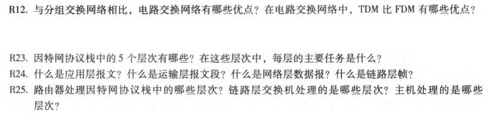

# 互联网计算 第1章-计算机网络和因特网

## 231880038 张国良

## Problem 1

**解：**

**电路交换网络相对于分组交换网络的优点：**

1. **保证带宽和延迟**：在电路交换网络中，通信双方之间会建立一条专用的物理路径，直到通信结束。这条路径在通信过程中一直被占用，保证了通信的带宽和延迟是稳定的
2. **实时性**：由于通信路径是专用的，通信过程中不会受到其他流量的干扰，延迟和丢包率较低，适用于实时应用，如语音、视频通话等
3. **可靠性**：电路交换建立了稳定的连接，一旦通道建立，通信会持续直到释放，因此它提供了高可靠性的连接
4. **简洁性**：通信过程中不需要复杂的路由算法，也不涉及数据包的拆分和重组，简单易懂

然而，电路交换的缺点在于资源的低效使用，通信过程中即使没有数据传输，专用通道仍然被占用，这导致了资源的浪费

**在电路交换网络中，TDM（时分复用）相对于FDM（频分复用）的优点：**

1. **频谱利用效率高**：TDM不需要多个频带的分配，只需要根据时间分配多个时隙，因此在频谱资源有限的情况下，TDM能更高效地使用带宽
2. **实现简单**：TDM的实现主要依赖时间分片，硬件和算法相对简单。而FDM需要为每个信号分配不同的频带，硬件设计和管理相对复杂
3. **抗干扰能力强**：TDM通过时隙的方式进行分时复用，每个信号传输的时间是固定的，不会相互干扰。而FDM需要对频带进行精确的划分和调制，容易受到频率干扰
4. **灵活性和扩展性**：TDM系统的时隙可以根据需要灵活调整，支持不同速率的传输。而FDM的频带分配一旦确定，改变起来比较困难

总的来说，TDM在时隙管理、频谱利用、抗干扰和灵活性方面相对优于FDM，特别适合需要高效利用资源的电路交换网络

## Problem 2

**解：**

1. **物理层（Physical Layer）**：

物理层负责在物理介质上传输原始比特流（即0和1）。它定义了硬件设备的电气、机械、过程和功能规范，如网卡、传输介质（如电缆、光纤等）以及信号的传输方式

- **主要任务**：负责数据的物理传输，确保比特在介质上能正确地传输，定义数据传输的电气标准、接口和信号编码方式

2. **数据链路层（Data Link Layer）**：

数据链路层的任务是提供可靠的点对点数据传输，它负责将物理层传来的比特流组织成帧，并确保帧的正确传输。常见的协议包括以太网、Wi-Fi等

- 主要任务
  - 帧的封装和解封装
  - 错误检测和纠正（如CRC检验）
  - 控制数据流，避免碰撞

3. **网络层（Network Layer）**：

网络层负责将数据从源设备传送到目标设备，主要任务是路由和寻址。最常用的协议是**IP**（互联网协议）。它将数据包封装为IP数据报，并负责选择路径（路由）和处理地址（如IP地址）

- 主要任务
  - 路由选择：通过路由器决定数据包的最佳路径
  - 地址分配：使用IP地址进行设备标识
  - 数据包转发：在不同的网络之间转发数据包

4. **传输层（Transport Layer）**：

传输层负责建立端到端的通信连接，确保数据在不同主机之间的可靠传输。它包括两种常用协议：**TCP（传输控制协议）和 UDP（用户数据报协议）**

- 主要任务
  - 可靠数据传输（如TCP协议通过确认机制确保数据完整性）
  - 流量控制与拥塞控制
  - 数据的分段与重组

5. **应用层（Application Layer）**：

应用层为最终用户提供服务，并定义了各种应用协议，如**HTTP**、**FTP**、**SMTP**、**DNS**等。应用层协议通过传输层传送数据到目标设备，并处理来自用户或其他应用程序的数据

- 主要任务
  - 提供应用服务（如Web浏览、文件传输、邮件传输等）
  - 实现应用协议的具体功能
  - 处理用户请求和响应

## Problem 3

**解：**

- **应用层报文**：是用户应用生成的原始数据，包含应用协议的内容
- **传输层报文段**：是传输层对应用层报文的封装，包含传输控制信息（如端口号、序列号等）
- **网络层数据报**：是网络层对传输层报文段的封装，包含路由和寻址信息（如IP地址）
- **链路层帧**：是链路层对网络层数据报的封装，包含物理传输所需的地址和控制信息（如MAC地址、帧校验码等）

每一层通过封装和解封装操作，在不同的网络设备之间传递数据，确保数据能够从源设备到达目标设备

## Problem 4

**解：**

1. **路由器处理的层次**：

路由器主要工作在**网络层**，它处理的是因特网协议栈中的**网络层**和**链路层**

- **网络层**：路由器的主要功能是根据**IP地址**来转发数据包（即IP数据报）。它根据目标IP地址查找路由表，选择合适的路由路径，并决定数据包的转发
- **链路层**：路由器还处理链路层的数据帧，尤其是在通过不同类型的链路（如以太网、Wi-Fi等）转发数据时。它需要根据不同链路的协议封装数据帧，并通过**MAC地址**来进行转发。路由器会在网络层数据报的基础上添加链路层的帧头，并在接收到数据时解开链路层的帧头

2. **链路层交换机处理的层次**：

链路层交换机（通常称为交换机）工作在**数据链路层**，它处理的是因特网协议栈中的**数据链路层**

- **数据链路层**：交换机根据**MAC地址**来转发数据帧。交换机维护一个**MAC地址表**，当接收到数据帧时，它根据源MAC地址学习设备的位置，并根据目标MAC地址来决定将数据帧转发到哪个端口。交换机不会涉及IP地址的处理，它仅处理数据链路层的帧

3. **主机处理的层次**：

主机（如计算机、手机等）会处理协议栈中的多个层次，包括**应用层**、**传输层**、**网络层**和**数据链路层**

- **应用层**：主机运行各种应用程序，生成和接收应用层数据，如浏览器、电子邮件客户端等。这些数据将传递给传输层
- **传输层**：主机使用传输层协议（如TCP或UDP）来控制数据的可靠性、流量管理、端口号等。它负责将应用层数据分段，并将其传递到网络层
- **网络层**：主机处理网络层的IP协议，负责将数据包路由到目标IP地址。主机根据目标IP地址选择是否发送数据，或者将数据转发到网关（路由器）进行下一步传输
- **数据链路层**：主机的网卡负责数据链路层的处理。它将网络层的数据包封装成数据帧，添加源和目标MAC地址，然后通过物理网络介质（如以太网）发送出去。在接收数据时，网卡负责解封装数据帧，提取出网络层的数据包