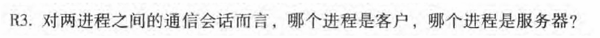
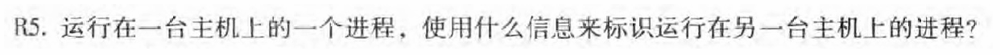
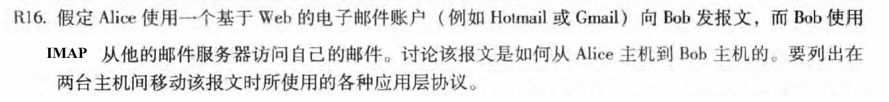
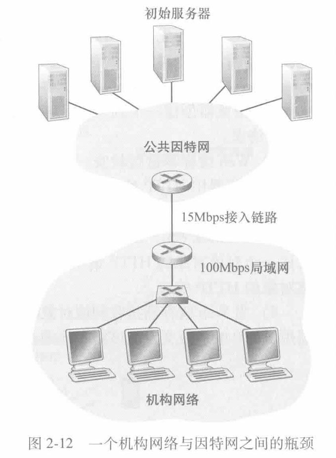
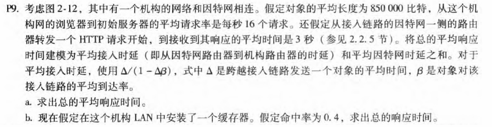
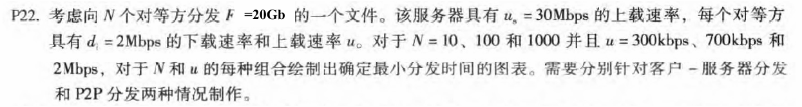

# 第2章-应用层

## 231880038 张国良

## Problem 1

**解：**

在进程间通信（IPC）或网络通信中，**客户端进程是主动发起请求的进程，而服务器进程是被动等待并响应请求的进程**。这个角色是相对的，有时候一个进程在某些通信会话中是客户端，而在另一些通信会话中是服务器。

## Problem 2

**解：**

使用**四元组（Socket 标识）**来标识

1. **源 IP 地址（Source IP Address）**：标识发送方主机的 IP 地址
2. **源端口号（Source Port）**：标识发送方主机上的进程
3. **目的 IP 地址（Destination IP Address）**：标识接收方主机的 IP 地址
4. **目的端口号（Destination Port）**：标识接收方主机上的进程

这四个要素唯一确定了一条 TCP 或 UDP 连接，从而确保数据能够正确地在主机之间的进程间传输

## Problem 3

**解：**

1.Alice 使用 Web 浏览器访问 Gmail 或 Hotmail（浏览器和 Web 邮件服务器之间的通信使用 **HTTP/HTTPS** 协议）并发送邮件

2.Gmail 或 Hotmail 的邮件服务器收到 Alice 的邮件请求后，会使用 **SMTP（Simple Mail Transfer Protocol）** 将邮件转发到 Bob 的邮件服务器

3.Bob 使用邮件客户端（如 Outlook、Thunderbird）或 Web 邮件客户端访问他的邮件服务器，他的邮件客户端使用 **IMAP（Internet Message Access Protocol）** 从邮件服务器读取邮件列表并下载邮件内容

## Problem 4

**解：**

### a.

$$
\Delta=(850000bits)/(15000000bits/sec)\approx0.0567sec\\\Delta\beta=16\times0.0567\approx0.907\\平均接入时延：0.0567/{(1-0.907)}\approx0.6sec\\总的平均响应时间：0.6+3=3.6sec
$$

故总的平均响应时间为3.6秒

### b.

则每16个请求有40%由机构满足
$$
平均接入时延：0.0567/{(1-0.6\times0.907)}\approx 0.1244sec\\命中则响应时间几乎为零\\总的平均响应时间为：0.6\times(3+0.1244)\approx1.875sec
$$
故总的平均响应时间为1.875秒

## Problem 5

**解：**
$$
D_{cs}=max\{NF/u_{s},F/d_{min}\}\\D_{p2p}=max\{F/u_{s},F/d_{min},NF/(u_{s}+\sum_{i=1}^{N}u_{i})\}\\带入F=20GB=20480MB\space,\space u_{s}=30Mbps\space,\space d_{min}=d_{i}=2Mbps
$$
**客户端服务器分发：**

| N\u  | 300kbps  | 700kbps  |  2Mbps   |
| :--: | :------: | :------: | :------: |
|  10  | 10737.4  | 10737.4  | 10737.4  |
| 100  | 71582.8  | 71582.8  | 71582.8  |
| 1000 | 715827.9 | 715827.9 | 715827.9 |

**P2P分发：**

| N\u  | 300kbps | 700kbps |  2Mbps  |
| :--: | :-----: | :-----: | :-----: |
|  10  | 10737.4 | 10737.4 | 10737.4 |
| 100  | 35791.4 | 21474.8 | 10737.4 |
| 1000 | 65075.3 | 29417.6 | 10737.4 |
