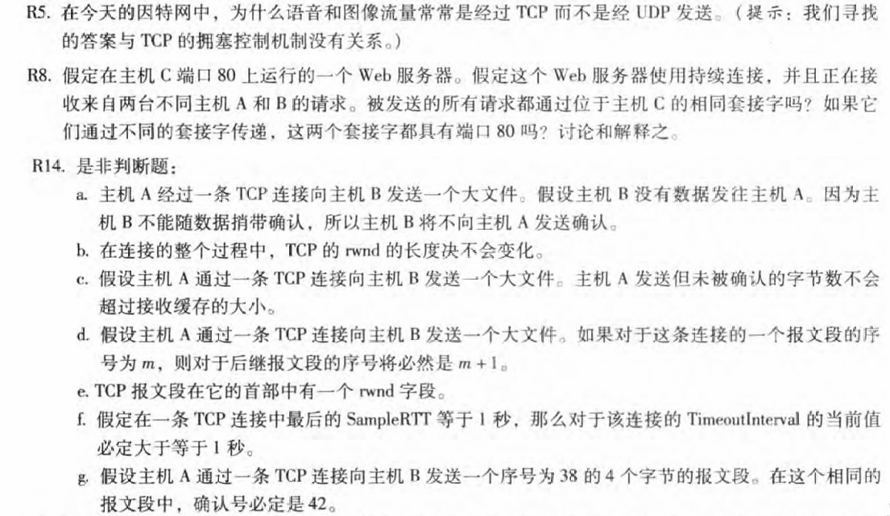
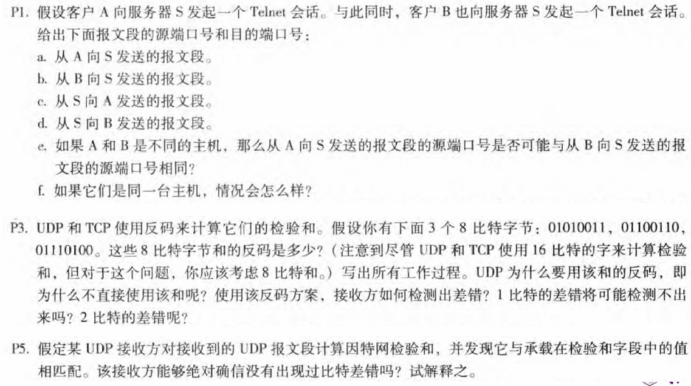

# 第3章-运输层(1)

## 231880038 张国良

## Problem 1

**解：**

由于大多数防火墙都被配置为阻止UDP通信，因此使用TCP进行视频和语音通信可以让通信通过防火墙

## Problem 2

**解：**

持续连接是TCP连接，连接套接字被标识为具有四个元组:（源IP地址、源端口号、目标IP地址、目标端口号），源IP地址不同，所以套接字并不相同，但是目标端口号都是80，所以都具有端口80

## Problem 3

**解：**

F F T F T F F

## Problem 4

**解：**

设A，B随机选择端口5000，5000

**a.** 5000，23

**b.** 5000，23

**c.** 23，5000

**d.** 23，5000

**e.** 有可能相同

**f.** 一定不相同

## Problem 5

**解：**

字节和（进位加到地位上）反码：`11010001`

为什么用反码：使用反码方案可以使发送方和接收方使用相同的计算方法来进行检验和的计算。发送方计算出检验和并将其放入报文段首部，接收方收到报文段后，将所有字段（包括检验和字段）相加，如果结果全为 1，则认为传输没有差错。如果直接使用和，接收方很难通过简单的相加操作来判断是否有差错

为了检测错误，接收方添加四个单词（三个原始单词和校验和）。如果和包含一个零，接收器知道有一个错误。所有的一位错误都会被检测到，但是两位错误可以不被检测到（例如，如果第一个单词的最后一个数字被转换为0，第二个单词的最后一个数字被转换为1）

## Problem 6

**解：**

不，接收方不能完全确定没有发生任何位错误。这是因为计算数据包的校验和的方式。如果包中两个16位字的对应位（相加在一起）是0和1，那么即使这些位分别翻转到1和0，和仍然保持不变。因此，接收方计算的1s反码也将是相同的。这意味着，即使存在传输错误，校验和也将进行验证
