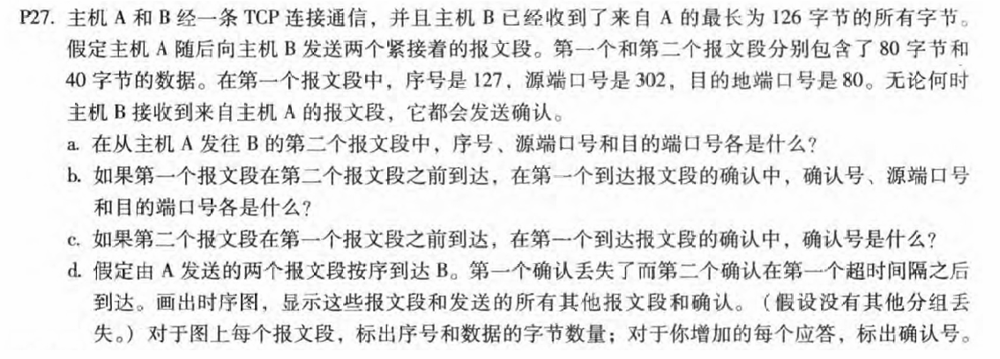
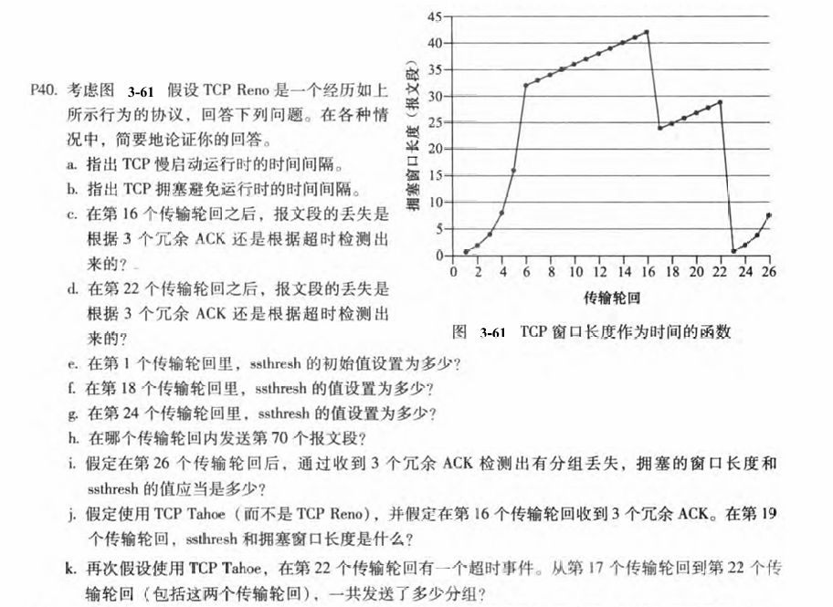
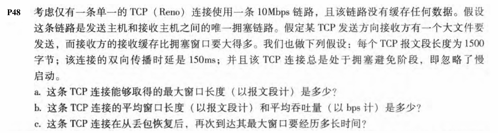
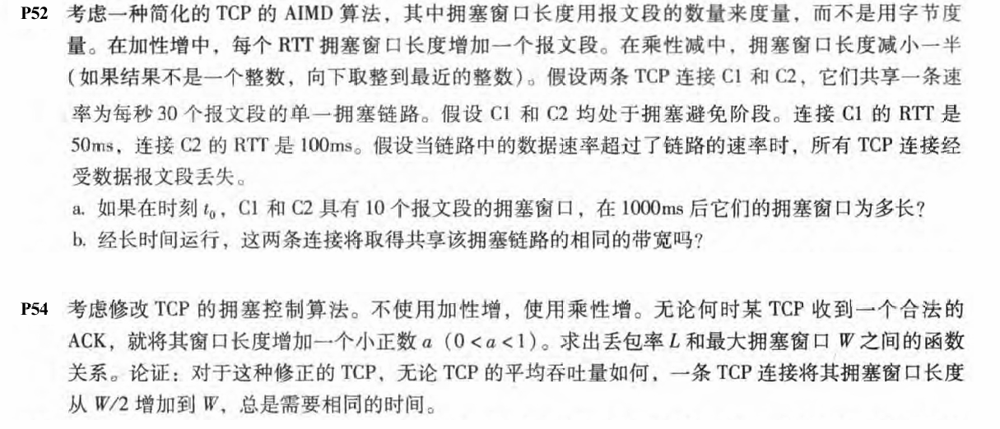
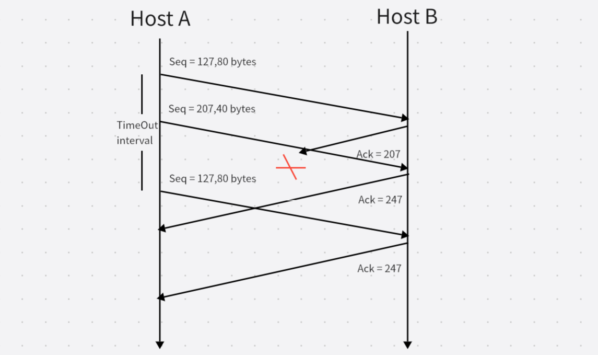

# 第3章-运输层(2)

## 231880038 张国良

## Problem 1

**a.** 序号是207，源端口是302，目的端口是80

**b.** 确认号是207，源端口是80，目的端口是302

**c.** 确认号是127，因为还在等待序号127数据包的到来

**d.**

## Problem 2

**a.** 在1 ~ 6和23 ~ 26慢启动

**b.** 在6 ~ 16和17 ~ 22拥塞避免

**c.** 根据三个冗余ACK，因为在16时未超时，窗口长度大概42，如果是超时检测，应该下降到1，而实际上下降到24，这是因为有三个冗余所以减半加上3

**d.** 第22次传输后，是由于超时而检测到段丢失，因为拥塞窗口大小设置为1

**e.** 阈值最初是32，因为它处于慢启动停止的窗口大小，并且拥塞避免开始

**f.** 当分组丢失时阈值被设置为拥塞窗口的值的一半。当在传输循环16期间检测到丢失时，拥塞Windows的大小为42。因此在第18传输循环期间阈值为21

**g.** 当分组丢失时阈值被设置为拥塞窗口的值的一半。当在传输循环22期间检测到丢失时，拥塞Windows的大小为29。因此，在第24轮传输中阈值为14.5（取下限为14）

**h.** 截止到6，共发送了63个报文段，在7将发送33个报文段，因此在7发送第70个报文段

**i.** 收到三个冗余ACK，阈值减半，窗口长度在阈值加三，所以阈值设为4，窗口长度设为7

**j.** 使用TCP Tahoe，阈值减半，下一轮回窗口长度设为1，随后指数增长，到19轮回，窗口长度为4，阈值为21

**k.** 在第17，1个报，18发送2个报文段，19发送4个报文段，20发送8个报文段，21发送16个报文段，22发送21个报文段，一共发送了52个报文段

## Problem 3

**a.** 
$$
\small\frac{W\times MSS}{RTT}=10Mbps\\代入得W=125\\所以最大窗口长度为125段
$$
**b.** 
$$
\small平均窗口长度：0.75W=93.75\\平均吞吐量：\frac{0.75W}{RTT}\times MSS=7500000bps
$$
**c.** 
$$
\small由题可知：该连接总是处于拥塞避免阶段\\丢包恢复后窗口大小为\frac{W}{2}，要增长到W\\耗时\frac{W}{2}\times RTT=9.375s
$$

## Problem 4

**a.**

|  时间  |   C1    |  C2  |
| :----: | :-----: | :--: |
|  0ms   |   10    |  10  |
|  50ms  |    5    |  10  |
| 100ms  |    2    |  5   |
| 150ms  |    1    |  5   |
| 200ms  |    1    |  2   |
| 250ms  |    1    |  2   |
| 300ms  |    1    |  1   |
| 350ms  |    2    |  1   |
| 400ms  |    1    |  1   |
|  ...   | 1/2变化 |  1   |
| 1000ms |    1    |  1   |

1000ms后C1窗口长度为1段，C2窗口长度为1段

**b.**

在长期运行中，C1的带宽份额大约是C2的两倍，因为C1具有较短的RTT，仅是C2的一半，因此C1可以将其窗口大小调整为C2的两倍

## Problem 5

$$
\small使用乘性增，窗口从\frac{W}{2}到W发出段数：\\
S=\frac{W}{2}+\frac{W}{2}(1+\alpha)+\frac{W}{2}(1+\alpha)^2+...+\frac{W}{2}(1+\alpha)^k\\
k=log_{(1+\alpha)}2\\
得出：S=\frac{W}{2}\times\frac{(1+\alpha)^{k+1}-1}{(1+\alpha)-1}=\frac{2\alpha+1}{2\alpha}W\\
L=\frac{1}{S}=\frac{2\alpha}{(2\alpha+1)W}\\
消耗时间：k\times RTT=RTTlog_{(1+\alpha)}2\\
仅和RTT与\alpha大小有关，与吞吐量大小显然无关
$$

