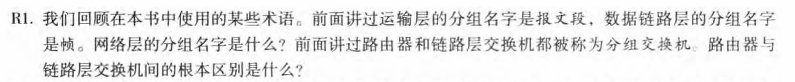
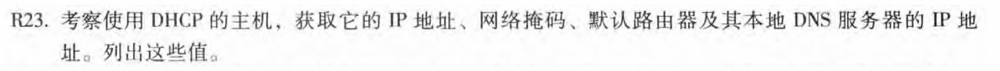
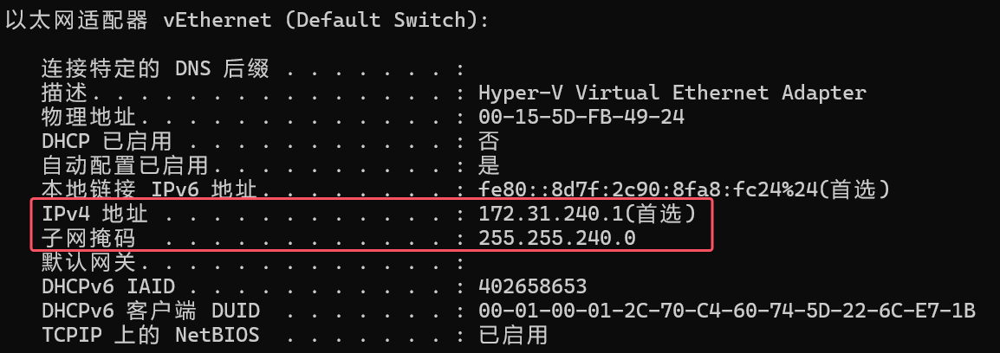
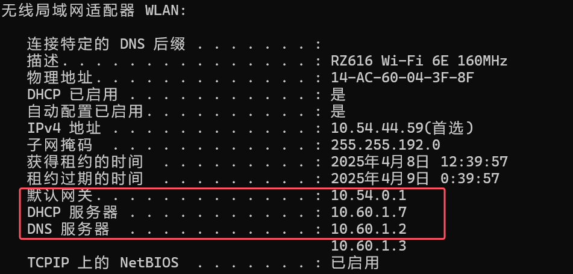
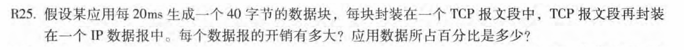
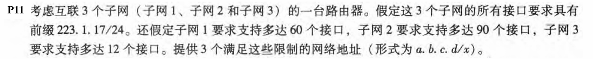
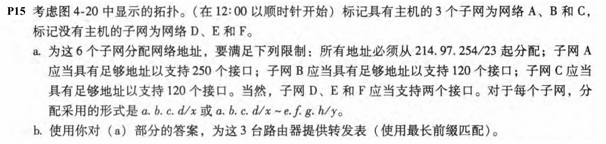

# 第4章-网络层: 数据平面 

## 231880038 张国良

## Problem 1


**解：**

网络层数据包是一种数据报。路由器根据数据包的IP(第3层)地址转发数据包。链路层交换机根据分组的MAC(第2层)地址转发分组

## Problem 2



**解：**
终端输入`ipconfig /all`查询：



得出：
我的主机IP：172.31.240.1
网络掩码：255.255.240.0
默认路由器：10.54.0.1
DNS服务器：10.60.1.2

## Problem 3



**解：**

TCP和IP头部都是20字节，每个数据报开销是40字节，应用数据占比为50%

## Problem 4



**解：**

```
子网2：223.1.17.0/25
子网1：223.1.17.128/26
子网3：223.1.17.192/28
```

## Problem 5



**解：**

**a.**

```
子网A：214.97.254.0/24
子网B：214.97.255.0/25
子网C：214.97.255.128/25 ~ 214.97.255.128/29
子网D：214.97.255.128/31
子网E：214.97.255.130/31
子网F：214.97.255.132/30
```

**b.**

```
Router 1:
Longest Prefix Match						Outgoing Interface
11010110 01100001 11111110					Subnet A
11010110 01100001 11111111 1000000				Subnet D
11010110 01100001 11111111 100001				Subnet F

Router 2:
Longest Prefix Match						Outgoing Interface
11010110 01100001 11111111 1000000				Subnet D
11010110 01100001 11111111 0					Subnet B
11010110 01100001 11111111 1000001				Subnet E

Router 3:
Longest Prefix Match						Outgoing Interface
11010110 01100001 11111110 100001				Subnet F
11010110 01100001 11111111 1000001				Subnet E
11010110 01100001 11111111 1					Subnet C
```

