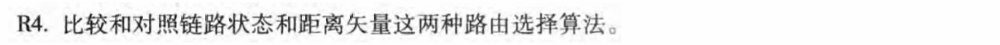
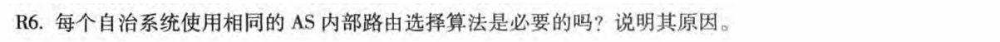
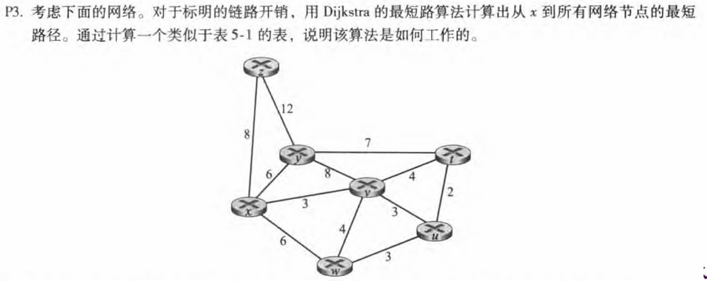
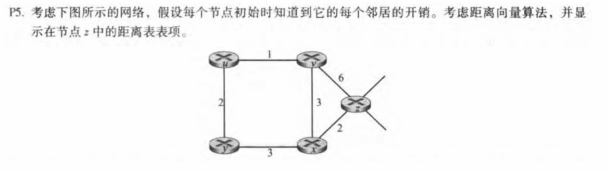
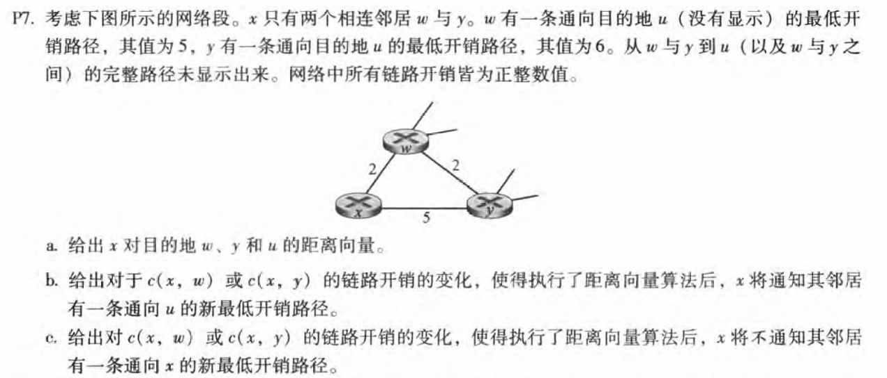
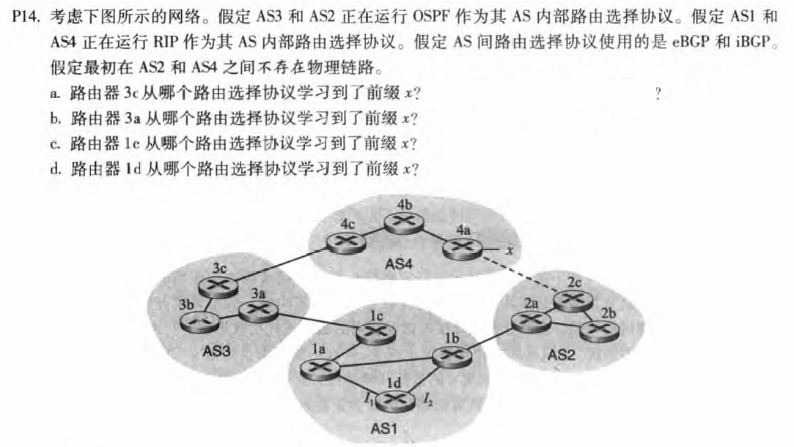

# 第5章-网络层: 控制平面

## 231880038 张国良

## Problem 1

**解：**

1. **消息复杂度**

- **LS**：需发送 `(O(n^2))` 条消息（n 为路由器数量）
- **DV**：仅在邻居间交换信息，收敛时间不固定

2. **收敛速度**

- **LS**：算法复杂度为 `(O(n^2))`，可能出现振荡
- **DV**：收敛时间不固定，可能产生路由循环和 “计数到无穷” 问题

3. **健壮性**

- **LS**：若路由器故障，可能通告错误的链路代价，但每个路由器仅计算自己的路由表，影响范围相对集中
- **DV**：若路由器通告错误路径代价（如 “拥有到各处的低成本路径”），会导致 “黑洞” 问题，且错误会通过网络传播，影响范围更广

## Problem 2

**解：** 没有，每个AS都具有在AS中路由的管理自主权

## Problem 3

**解：**

| step |   N′    | D(t),p(t) | D(u),p(u) | D(v),p(v) | D(w),p(w) | D(y),p(y) | D(z),p(z) |
| :--: | :-----: | :-------: | :-------: | :-------: | :-------: | :-------: | :-------: |
|  0   |    x    |     ∞     |     ∞     |    3,x    |    6,x    |    6,x    |    8,x    |
|  1   |   xv    |    7,v    |    6,v    |    3,x    |    6,x    |    6,x    |    8,x    |
|  2   |   xvu   |    7,v    |    6,v    |    3,x    |    6,x    |    6,x    |    8,x    |
|  3   |  xvuw   |    7,v    |    6,v    |    3,x    |    6,x    |    6,x    |    8,x    |
|  4   |  xvuwy  |    7,v    |    6,v    |    3,x    |    6,x    |    6,x    |    8,x    |
|  5   | xvuwyt  |    7,v    |    6,v    |    3,x    |    6,x    |    6,x    |    8,x    |
|  6   | xvuwytz |    7,v    |    6,v    |    3,x    |    6,x    |    6,x    |    8,x    |

## Problem 4

**解：**

| step | D(x) | D(y) | D(v) | D(u) |
| :--: | :--: | :--: | :--: | :--: |
|  0   |  ∞   |  ∞   |  ∞   |  ∞   |
|  1   |  2   |  ∞   |  6   |  ∞   |
|  2   |  2   |  5   |  5   |  7   |
|  3   |  2   |  5   |  5   |  6   |
|  4   |  2   |  5   |  5   |  6   |

## Problem 5

**a.**
$$
D_x(w)=2\quad D_x(y)=4\quad D_x(u)=7\quad
$$
**b.**
$$
c(x,w)只要变化就会更新到u的更短路径(c(x,w)<2则通知最短路径减小\\2<c(x,w)\leq 6则通知最短路径增加c(x,w)>6则通知最短路径变更为11且通过y)\\
c(x,y)<1会更新到u的更短路径(通知最短路径变为通过y的c(x,y)+6)
$$
**c.**
$$
c(x,w)只要变化就会通知更新\\
c(x,y)\geq 1不会通知更新
$$

## Problem 6

**a.** eBGP

**b.** iBGP

**c.** eBGP

**d.** iBGP