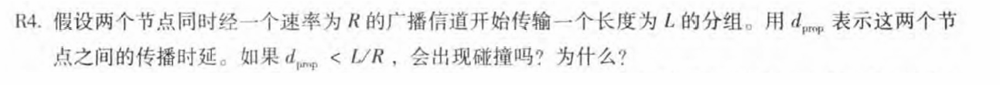
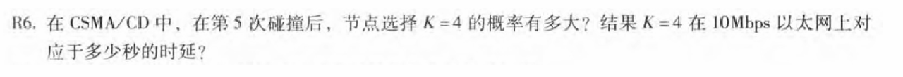
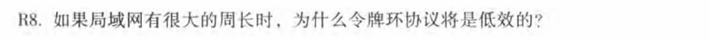
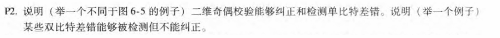
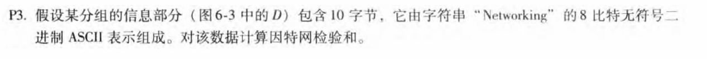
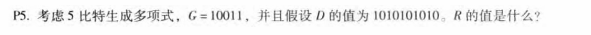
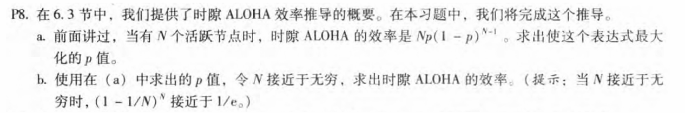

# 第6章-链路层和局域网(1)

## 231880038 张国良

### Problem1
**解：** 会发生碰撞，因为同时传输分组，分组到达的时延大于节点之间的传播时延，两个节点会接收到对方的分组，所以会碰撞

### Problem2

**解：** 第五次碰撞在`[0,31]`之间选择`K`，`K=4`的概率为`1/32`，等待`(4*512bit)/10Mbps=204.8us`,即204.8微秒

### Problem3

**解：** 令牌绕环一周的时间变得更长，每个节点需等待令牌到达才能发送数据，若部分节点有大量数据传输，其他节点会面临更长的等待时间，导致整体吞吐量下降，其次令牌传递需要时间，当只有一个节点要传输，也要等令牌轮转一圈

### Problem4

**解：**

```c
0 0 0     0 0 0
1 1 1  -> 1 0 1    第二行第二列的奇偶校验码错误，可以检测并纠正单比特错误
1 0 1     1 0 1

0 0 0     0 0 0
1 1 1  -> 1 0 1    第二行第三行的奇偶校验码错误，但是第二列奇偶校验码正确，检测到错误但是不能纠正
1 0 1     1 1 1
```

### Problem5

**解：**

```c
  01001100 01101001 
+ 01101110 01101011 
------------------------------ 
  10111010 11010100 
+ 00100000 01001100 
------------------------------ 
  11011011 00100000 
+ 01100001 01111001
----------------------------- 
  00111100 10011010 (溢出，然后绕过去) 
+ 01100101 01110010 
------------------------------ 
  10100010 00001100 
      
取反得到: 01011101 11110011
```

### Problem6

**解：**

```c
      	   101101 1100
      |----------------
10011 |1010101010 0000
       10011
       ----------------
         11001
         10011
       ----------------
           10100
           10011
       ----------------
              11110
              10011
       ----------------
                11010
                10011
       ----------------
                 11010
                 10011
       ----------------
                  10010
                  10011
       ----------------
                      100
               
所以R的值为: 0100
```


### Problem7

**解：**

**a.**
$$
E(p)=Np{(1-p)}^{N-1}\\
E^{'}(p)=N{(1-p)}^{N-1}-N(N-1)p{(1-p)}^{N-2}=N{(1-p)}^{N-1}((1-p)-p(N-1))\\
E^{'}(p)=0=>p=\frac 1 N\\
故p为\frac 1 N 时表达式最大
$$
**b.**
$$
E(\frac 1 N)={(1-\frac 1 N )}^{N-1} = \frac{{(1-\frac 1 N )}^{N}}{1-\frac 1 N }\\
lim_{N\to\infty}E(\frac 1 N)=\frac{1}{e}\\
故效率为 \frac{1}{e} 
$$


