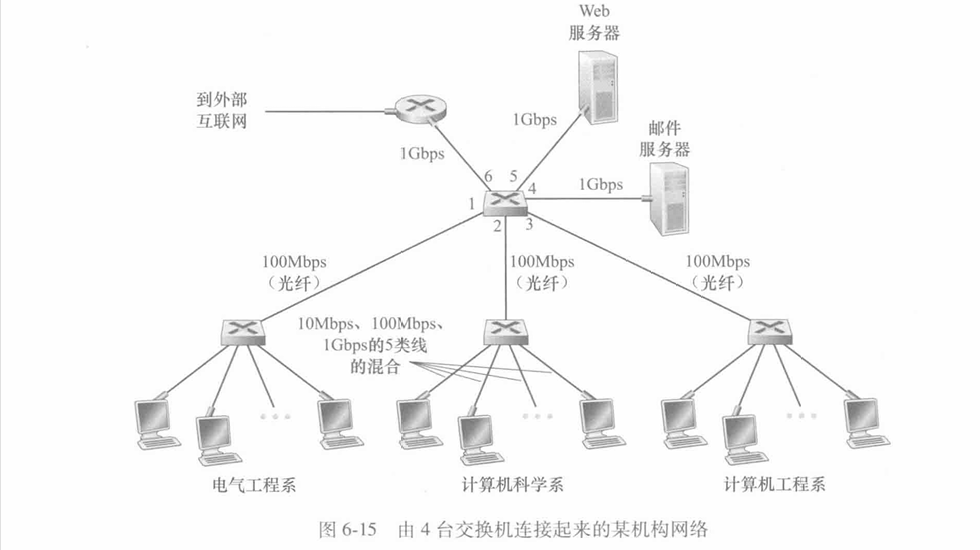
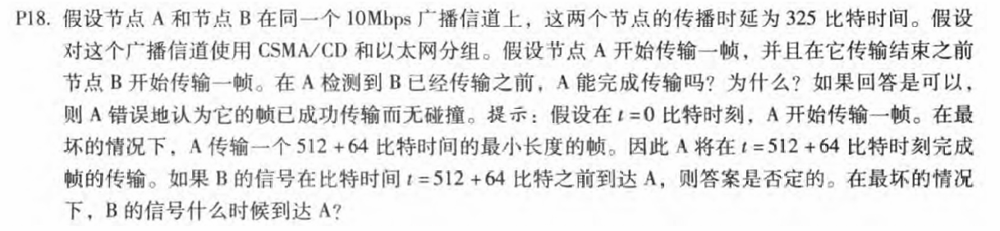
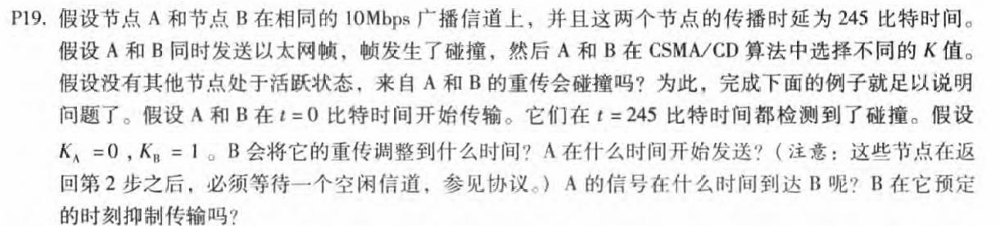
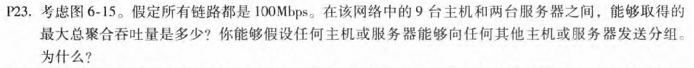
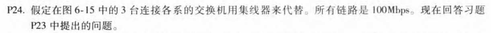
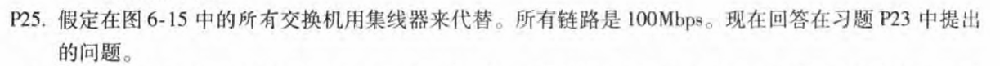
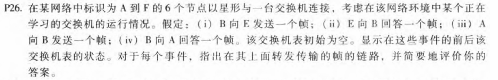

# 第6章-链路层和局域网(2)

## 231880038 张国良

## Problem 1

在t=0时A传输，在t=576时，A将完成传输。在最坏的情况下，B在时间t=324开始发送，即A的第一个帧到达B之前的时间，在时间t=324+325=649时B的第一个比特到达A时，A在检测到B已经发送之前就完成了传输，所以A错误地认为它的帧在没有碰撞的情况下被成功地传输了

## Problem 2

```c
t=245 AB检测到碰撞 发送48比特的干扰信号
t=293 A B开始等待 A等待完成 B需要在t=293+512=805等待完成
t=293+245=538 A B的干扰信号全部到达 A开始侦听信道
t=538+96=634 A开始传输
t=293+512=805 B等待完成 B开始侦听信道
t=634+245=879 A传达到达B
t=805+96=901 B开始传输

所以综上 B重传时间在901比特时间，A在634比特时间发送，A信号在879比特时间到达B
B在预定时刻不会抑制传输，因为512比特时间足够大隐含覆盖传播时延影响

```

## Problem 3

不存在冲突域，最大聚合吞吐率为`100*11=1100Mbps`

## Problem 4

具有三个冲突域，最大聚合吞吐率为`100*3+100*2=500Mbps`

## Problem 5

都处于冲突域，最大聚合吞吐率为`100Mbps`

## Problem 6

| 行为         | 开关表状态                       | 链路包前往 | 解释                                                       |
| ------------ | -------------------------------- | ---------- | ---------------------------------------------------------- |
| B发送一帧给E | 与B的MAC地址对应的交换机学习接口 | A,C,D,E,F  | 由于交换机表是空的，所以交换机不知道与E的MAC地址对应的接口 |
| E发送一帧给B | 与E的MAC地址对应的交换机学习接口 | B          | 由于交换机已经知道与B的MAC地址对应的接口                   |
| A发送一帧给B | 与A的MAC地址对应的交换机学习接口 | B          | 由于交换机已经知道与B的MAC地址对应的接口                   |
| B发送一帧给A | 切换表状态与以前相同。           | A          | 由于交换机已经知道与A的MAC地址对应的接口                   |