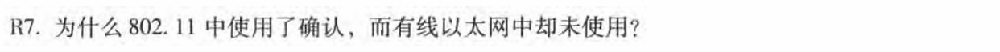
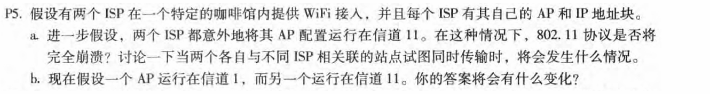
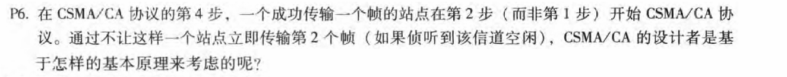
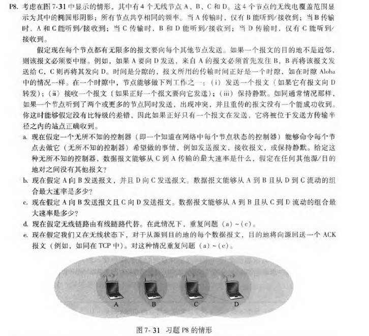

# 第7章-无线网络和移动网络

## 231880038 张国良

## Problem 1

**解：**

​	无线信道是天然不可靠的，无线设备通常工作在半双工模式（发送和接收不能同时进行），无法像有线网络那样通过 CSMA/CD 实时检测冲突，且为了避免隐藏终端问题

​	802.11 使用确认机制而以太网不使用，核心原因在于无线介质的不可靠性与有线介质的高可靠性之间的根本差异。无线环境需要链路层确认来弥补信号不稳定、冲突检测困难等问题，而以太网通过 CSMA/CD 和物理层可靠性实现高效传输，无需额外确认

## Problem 2

**a.**

​	两个AP通常具有不同的SSID和MAC地址。无线站到达cafe将与其中一个SSID（即其中一个AP）相关联。在关联之后，在新站点和AP之间存在虚拟链路。标记AP1和AP2。假设新站点与AP1相关联。当新的站发送帧，它将被寻址到AP1。尽管AP2还将接收帧，因为帧未被寻址，所以它将不处理帧。因此，两个ISP可以在同一信道上并行工作。然而，这两个ISP将共享相同的无线带宽。如果不同的无线站不同ISP同时发送，会发生冲突

**b.**

​	现在，如果不同ISP（以及因此不同的信道）中的两个无线站发送同时，不会发生碰撞

## Problem 3

**解：**

​	假设无线站H1有1000个长帧要发送。(H1可能是将MP3转发到其他无线电台的AP)假设最初H1是唯一想要传输的站，但是在传输其第一个帧的中途，H2想发送一个帧。为了简单起见，也假设每个站都能听到其他站的信号(也就是说，没有隐藏的终端)。在传输之前，H2将感觉到信道是繁忙的，因此选择一个随机的退避值

## Problem 4

## 

**a.**

`1 message/ 2 slots`

**b.**

`2 message/slots`

**c.**

`1 message/slots`

**d.**

分别为：

- `1 message/slots`
- `2 message/slots`
- `2 message/slots`

**e.**

1)

A先向B发送报文，B向A发送ACK，B再向C发送报文，C再向B发送ACK

所以速率是：`1 message/ 4 slots`

2)

A，D先同时分别向B，C发送报文，然后B或者C回复ACK，然后剩下的一个回复ACK

所以速率是：`2 message/ 3 slots`

3)

A先向B发送报文，B回复ACK给A的同时C向D发送报文，最后D回复ACK给C

所以速率是：`2 message/ 3 slots`