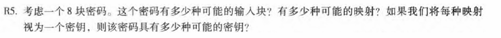
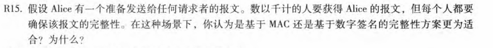
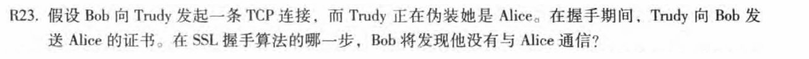
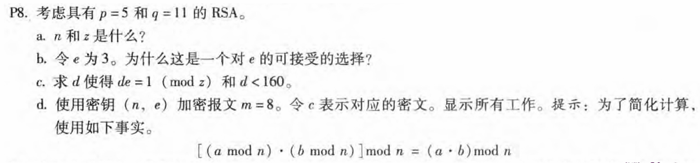
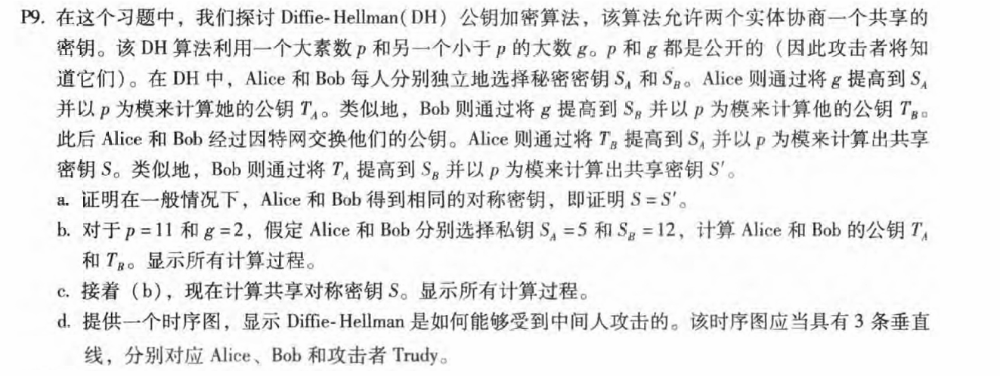
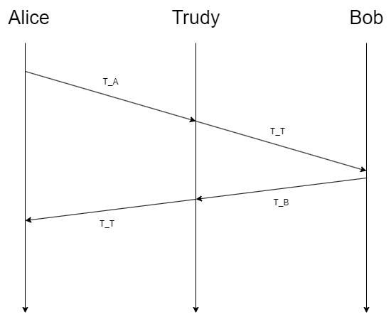
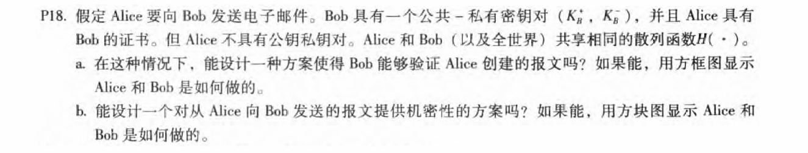
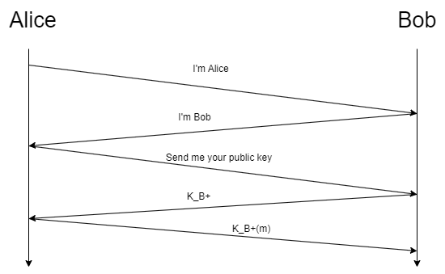

# 第8章-计算机网络中的安全 

## 231880038 张国良

## Problem 1

**解：**
$$
8块密码共有2^8钟可能的输入块，两两对应映射，共有2^8!种可能的映射，所以有2^8!种密钥
$$

## Problem 2

**解：**

对于基于MAC的方案，Alice必须与每个潜在的接收者建立共享密钥。对于数字签名，她对每个接收者使用相同的数字签名；数字签名是通过用她的私钥签名消息的散列来创建的。数字签名显然是更好的选择

## Problem 3

**解：**

客户端将生成预主密钥(PMS)后，它将用Alice对其进行加密公钥，然后将加密的PMS发送到Truddy。Truddy将无法解密PMS，因为她没有Alice的私钥。因此,Truddy将不能够确定共享的认证密钥。她可以猜猜看一个人选择随机密钥。在握手的最后一个步骤中，她向Bob发送所有握手消息的MAC，使用所猜测的验证密钥。当Bob接收MAC，MAC测试将失败，Bob将结束TCP连接。

## Problem 4

**a.**
$$
n=pq=55\\
z=(p-1)(q-1)=40
$$
**b.**
$$
因为3小于55并且和40互质
$$
**c.**

```
i := 41
d := 1
while d < 160:
	d := i / 3;
	if i % 3 == 0: 选出一个符合题意的d
	i := i + 40
最终得到d为27或67或107或147
```

**d.**
$$
密钥为(55,3)\\
c=m^e\mod n=8^3\mod 55=17
$$

## Problem 5

**a.**
$$
S=T_B^{S_A}\%p=(g^{S_B}\%p)^{S_A}\%p=g^{S_AS_B}\%p\\
S'=T_A^{S_B}\%p=(g^{S_A}\%p)^{S_B}\%p=g^{S_BS_A}\%p\\
所以S=S'
$$
**b.**
$$
T_A=g^{S_A}\%p=10\\
T_B=g^{S_B}\%p=4
$$
**c,**
$$
S=T_B^{S_A}\%p=1\\
S'=T_A^{S_B}\%p=1
$$
**d.**



Trudy向Alice伪装成Bob并且向Bob伪装成Alice，最终Alice与Trudy之间商量了共享密钥S_AT，Bob与Trudy之间商量了共享密钥S_BT，最终Alice与Bob间的通话受到了Trudy的攻击

## Problem 6

**a.**

没有有公钥/私钥对或预共享秘密，Bob无法验证Alice创建了消息

**b.**

可以，Alice使用Bob的公钥对消息进行加密，并向Bob发送加密消息

