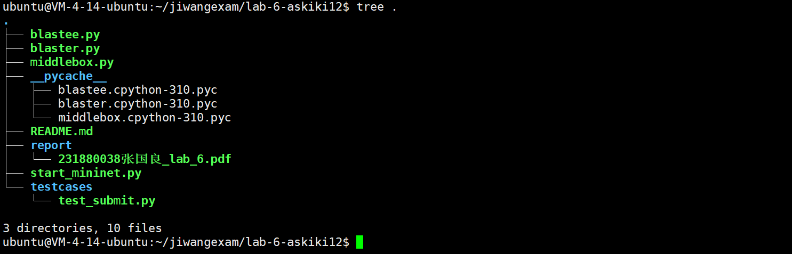
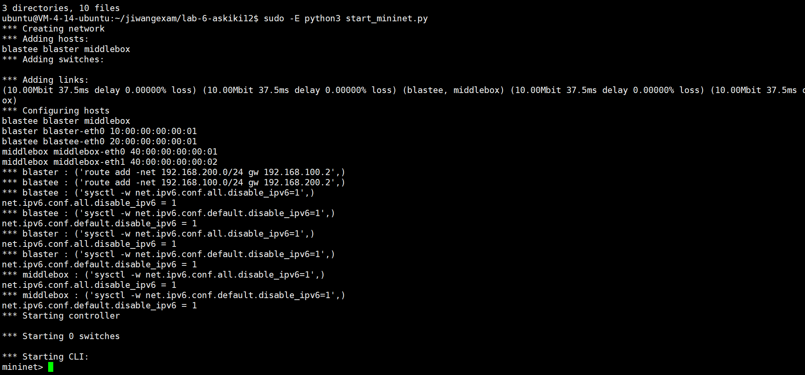
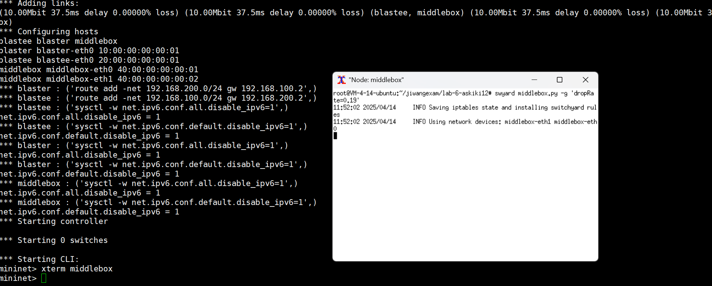
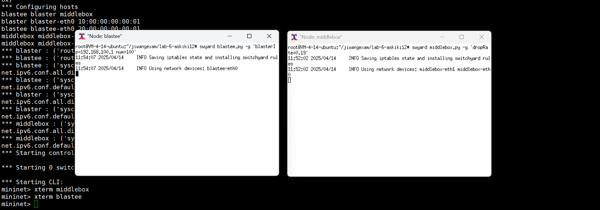
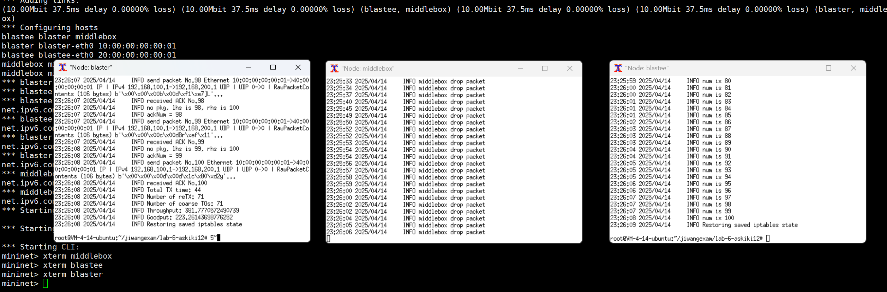
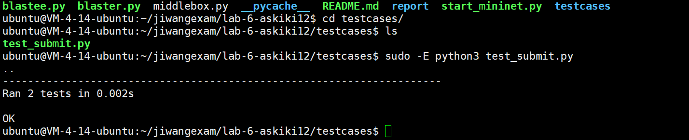

# 南京大学本科生实验报告

课程名称：**计算机网络**            任课教师：殷亚凤            助教：

| 学院  | **智能软件与工程学院** | 专业（方向）  | **智能软件工程**       |
| ----- | ---------------------- | ------------- | ---------------------- |
| 学号  | **231880038**          | 姓名          | **张国良**             |
| Email | **764632656@qq.com**   | 开始/完成日期 | **2025.4.6-2025.4.14** |

## **1.**  **实验名称**

**实验6：可靠通信** **(Reliable Communication)**

## **2.**  **实验目的**

**在Switchyard中构建一个可靠的通信库**

## **3.**  **实验内容**

### **任务1**：克隆Lab-6作业模板代码

利用git克隆代码

### **任务2**：模拟实现中间盒

实现中间盒，中间盒将有两个端口，每个端口连接一个设备：一个连接发送方（`blaster`），另一个连接接收方（`blastee`）。将 IP-MAC 映射硬编码到中间盒的代码中，如果中间盒从其 `eth0` 接口（即来自发送方）收到一个数据包，它会将其转发到 `eth1` 接口（即发送给接收方），反之亦然。除此之外，中间盒还将负责以概率方式丢弃数据包，以模拟真实网络中可能发生的所有不良事件。丢包只会发生在一个方向，从发送方（`blaster`）到接收方（`blastee`）（即不丢弃 `ACK` 包）。

### **任务3**：接收方（`Blastee`）

接收方（`Blastee`）将从发送方（`Blaster`）接收数据包，并立即发送确认（`ACK`）。接收方会从接收到的数据报中提取序列号信息，并创建一个包含相同序列号的确认（`ACK`）包与 TCP 基于字节的序列号不同，你的实现将使用基于包粒度的序列号。

### **任务4**：发送方（`Blaster`）

`Blaster`向`Blastee`发送 / 接收可变大小的 IP 数据包 / 确认包（`ACK`）。如前所述，它将在包粒度上实现固定大小的发送窗口（`SW`）和粗粒度超时机制。为明确发送窗口的工作机制，我们定义两个变量 `LHS` 和 `RHS`（均始终≥1），其中 `LHS` 和 `RHS`（对应两个已发送但未必已确认的数据包的序列号）表示发送窗口的当前边界，确保始终满足以下条件： `RHS – LHS + 1 <= SW` 发送窗口（`SW`）实际上对发送方与接收方之间传输中未确认（`unACKd`）的数据包最大数量进行了限制。

更新右边界（`RHS`）的逻辑很简单：发送方每发送一个数据包，`RHS` 的值就会在不违反上述条件的前提下递增。然而，更新左边（`LHS`）的值则更为复杂。`LHS` 指向具有最小序列号 `Si` 的数据包，满足以下条件：每个序列号 `Sj < Si` 的数据包均已成功确认.

### **任务5**：测试代码并提交

进行代码测试提交

## 4.实验结果

### **任务1：克隆仓库并基本实现要求的目录结构**


### **任务2：模拟实现中间盒，按要求增加丢包模拟**







### 任务3：模拟实现接收方并发送ACK



### 任务4：按照要求模拟实现发送方


### 任务5：测试代码提交


## 5.核心代码

### middlebox.py:

```python
#!/usr/bin/env python3

from struct import pack
import time
import threading
from random import randint

import switchyard
from switchyard.lib.address import *
from switchyard.lib.packet import *
from switchyard.lib.userlib import *


class Middlebox:
    def __init__(
            self,
            net: switchyard.llnetbase.LLNetBase,
            dropRate="0.19"
    ):
        self.net = net
        self.dropRate = float(dropRate)


    def handle_packet(self, recv: switchyard.llnetbase.ReceivedPacket):
        _, fromIface, packet = recv
        if fromIface == "middlebox-eth0":
            log_debug("Received from blaster")
            '''
            Received data packet
            Should I drop it?
            If not, modify headers & send to blastee
            '''
            randomNum = randint(1, 100)
            if randomNum < int(self.dropRate * 100):
                log_info("middlebox drop packet")
                return
            eth = Ethernet()
            eth.ethertype = packet[Ethernet].ethertype
            eth.src = self.net.interface_by_name("middlebox-eth1").ethaddr
            eth.dst = EthAddr('20:00:00:00:00:01')
            del packet[Ethernet]
            packet.insert_header(0, eth)
            self.net.send_packet("middlebox-eth1", packet)
        elif fromIface == "middlebox-eth1":
            log_debug("Received from blastee")
            '''
            Received ACK
            Modify headers & send to blaster. Not dropping ACK packets!
            net.send_packet("middlebox-eth0", pkt)
            '''
            if packet.has_header(Ethernet) == False:
                return
            eth = Ethernet()
            eth.ethertype = packet[Ethernet].ethertype
            eth.src = self.net.interface_by_name("middlebox-eth0").ethaddr
            eth.dst = EthAddr('10:00:00:00:00:01')
            del packet[Ethernet]
            packet.insert_header(0, eth)
            self.net.send_packet("middlebox-eth0", packet)
        else:
            log_debug("Oops :))")

    def start(self):
        '''A running daemon of the router.
        Receive packets until the end of time.
        '''
        while True:
            try:
                recv = self.net.recv_packet(timeout=1.0)
            except NoPackets:
                continue
            except Shutdown:
                break

            self.handle_packet(recv)

        self.shutdown()

    def shutdown(self):
        self.net.shutdown()


def main(net, **kwargs):
    middlebox = Middlebox(net, **kwargs)
    middlebox.start()
```

接口名是`"middlebox-eth0"`则数据包来自发送方

有`dropRate`的概率丢包，随后修改MAC地址：

- 发送方到中间盒的数据包，原以太网头部的源 MAC 是 `Blaster` 的 MAC，目标 MAC 是中间盒 `eth0` 的 MAC
- 中间盒转发时，需将源 MAC 修改为自身 eth1 的 MAC，目标 MAC 修改为 `Blastee` 的 MAC（硬编码为 `20:00:00:00:00:01`），以便 Blastee 正确接收

接口名是`"middlebox-eth1"`则中间盒处理来自接收方（`Blastee`）的 ACK 包

按照要求：

- **不丢包**：`ACK` 包从 `Blastee` 到 `Blaster`，中间盒直接转发，不执行丢包逻辑
- **MAC 地址修改**：将源 MAC 改为中间盒 `eth0` 的 MAC，目标 MAC 改为 `Blaster` 的 MAC（硬编码为 `10:00:00:00:00:01`），确保 `Blaster` 正确接收 `ACK`

### blastee.py:

```python
#!/usr/bin/env python3

import copy
import time
import threading
from struct import pack
import switchyard
from switchyard.lib.address import *
from switchyard.lib.packet import *
from switchyard.lib.userlib import *


class Blastee:
    def __init__(
            self,
            net: switchyard.llnetbase.LLNetBase,
            blasterIp = "192.168.100.1",
            num = "39"
    ):
        self.net = net
        # TODO: store the parameters
        self.blasterip = IPv4Address(blasterIp)
        self.num = int(num)
        self.recvCount = int(0)
        self.recvPacket = set()

    def handle_packet(self, recv: switchyard.llnetbase.ReceivedPacket):
        _, fromIface, packet = recv
        log_debug(f"I got a packet from {fromIface}")
        log_debug(f"Pkt: {packet}")
        if packet.has_header(Ethernet) == False or packet.has_header(IPv4) == False or packet.has_header(UDP) == False:
            return
        del packet[Ethernet]
        del packet[IPv4]
        del packet[UDP]
        p = Packet()
        eth = Ethernet()
        eth.ethertype = EtherType.IPv4
        eth.src = '20:00:00:00:00:01'
        eth.dst = '40:00:00:00:00:02'
        p += eth
        ipv4 = IPv4()
        ipv4.src = '192.168.200.1'
        ipv4.dst = self.blasterip
        ipv4.protocol = IPProtocol.UDP
        ipv4.ttl = 2
        p += ipv4
        p += UDP()
        log_info(f"num is {int.from_bytes(packet[0].to_bytes()[:4], 'big')}")
        if int.from_bytes(packet[0].to_bytes()[:4], 'big') not in self.recvPacket:
            self.recvCount += 1
            self.recvPacket.add(int.from_bytes(packet[0].to_bytes()[:4], 'big'))
        seqpl = RawPacketContents(packet[0].to_bytes()[:4] + (packet[0].to_bytes()[6:] + bytes(8))[:8])
        p += seqpl
        #log_info(f"{p}")
        self.net.send_packet(fromIface, p)
        if self.recvCount == self.num:
            self.shutdown()

    def start(self):
        '''A running daemon of the blastee.
        Receive packets until the end of time.
        '''
        while True:
            try:
                recv = self.net.recv_packet(timeout=1.0)
            except NoPackets:
                continue
            except Shutdown:
                break

            self.handle_packet(recv)

        self.shutdown()

    def shutdown(self):
        self.net.shutdown()


def main(net, **kwargs):
    blastee = Blastee(net, **kwargs)
    blastee.start()
```

- 接收一个 `ReceivedPacket` 对象，从中提取接收接口 `fromIface` 和数据包 `packet`。
- 检查数据包是否包含 `Ethernet`、`IPv4` 和 `UDP` 头部，如果不包含则直接返回。
- 删除原数据包的 `Ethernet`、`IPv4` 和 `UDP` 头部。
- 创建一个新的数据包p并添加新的`Ethernet`、`IPv4`和`UDP`头部：
  - `Ethernet` 头部：源 MAC 地址为 `'20:00:00:00:00:01'`，目标 MAC 地址为 `'40:00:00:00:00:02'`。
  - `IPv4` 头部：源 IP 地址为 `'192.168.200.1'`，目标 IP 地址为 `Blaster` 的 IP 地址，协议为 UDP，TTL 为 2。
- 提取原数据包中的序号（前 4 个字节），如果该序号不在 `recvPacket` 集合中，则将 `recvCount` 加 1，并将该序号添加到 `recvPacket` 集合中。
- 创建一个 `RawPacketContents` 对象 `seqpl`，包含序号和其他数据，添加到新数据包 `p` 中。
- 通过接收接口 `fromIface` 发送新数据包 `p`。
- 如果 `recvCount` 等于 `num`，则调用 `shutdown` 方法关闭网络连接。

### blaster.py:

```python
#!/usr/bin/env python3

import time
from random import randint, random
import switchyard
from switchyard.lib.address import *
from switchyard.lib.packet import *
from switchyard.lib.userlib import *


class Blaster:
    def __init__(
            self,
            net: switchyard.llnetbase.LLNetBase,
            blasteeIp = "192.168.200.1",
            num = "39",
            length="100",
            senderWindow="5",
            timeout="3000",
            recvTimeout="1000"
    ):
        self.net = net
        # TODO: store the parameters
        self.blasteeip = blasteeIp
        self.num = int(num)
        self.pllength = int(length)
        self.sw = int(senderWindow)
        self.timeout = float(int(timeout) / 1000)
        self.recvtimeout = float(int(recvTimeout) / 1000)
        self.startTime = 0
        self.ackNum = 0
        self.ack = set()
        self.lhs = 0
        self.rhs = 0
        self.timer = time.time()
        self.sendCount = {}
        self.toCount = 0
        self.sendbytesCount = 0
        self.pl = {}
        self.sendnext = True

    def handle_packet(self, recv: switchyard.llnetbase.ReceivedPacket):
        _, fromIface, packet = recv
        log_debug("I got a packet")
        if packet.has_header(Ethernet) == False or packet.has_header(IPv4) == False or packet.has_header(UDP) == False:
            return
        del packet[0]
        del packet[0]
        del packet[0]
        recvACK = int.from_bytes(packet[0].to_bytes()[:4], 'big')
        if recvACK not in self.ack:
            self.ack.add(recvACK)
            self.ackNum += 1
        log_info(f"received ACK No.{recvACK}")
        if self.ackNum == self.num:
            self.shutdown(printInfo=True)
        if self.lhs in self.ack:
            self.sendnext = True

    def handle_no_packet(self):
        log_debug("Didn't receive anything")
        log_info(f"no pkg, lhs is {self.lhs}, rhs is {self.rhs}")

        # Creating the headers for the packet
        pkt = Ethernet() + IPv4() + UDP()
        pkt[0].dst = '40:00:00:00:00:01'
        pkt[0].ethertype = EtherType.IPv4
        pkt[0].src = '10:00:00:00:00:01'
        pkt[1].src = '192.168.100.1'
        pkt[1].protocol = IPProtocol.UDP
        pkt[1].dst = '192.168.200.1'

        # Do other things here and send packet
        while self.lhs in self.ack:
            self.lhs += 1
        self.rhs = min(self.num, self.lhs + self.sw - 1)
        log_info(f"ackNum = {self.ackNum}")
        if self.ackNum == self.num:
            self.shutdown(printInfo=True)
        for i in range(self.lhs, self.rhs + 1):
            if i in self.ack:
                continue
            if i not in self.sendCount:
                self.sendCount[i] = 1
            else:
                self.sendCount[i] += 1
            if i not in self.pl.keys():
                pl = randint(0, pow(2, self.pllength * 8) - 1)
                self.pl[i] = pl
            seqlenpl = RawPacketContents(i.to_bytes(4, 'big') + self.pllength.to_bytes(2, 'big') 
                + self.pl[i].to_bytes(self.pllength, 'big'))
            self.sendbytesCount += self.pllength
            self.net.send_packet(self.net.interfaces()[0].name, pkt + seqlenpl)
            log_info(f"send packet No.{int.from_bytes(seqlenpl.to_bytes()[:4], 'big')} {pkt + seqlenpl}")
            break

    def start(self):
        '''A running daemon of the blaster.
        Receive packets until the end of time.
        '''
        self.startTime = time.time()
        self.lhs = 1
        self.rhs = 1
        while True:
            try:
                recv = self.net.recv_packet(timeout=self.recvtimeout)
            except NoPackets:
                if self.sendnext:
                    self.timer = time.time()
                    self.handle_no_packet()
                    self.sendnext = False
                elif (time.time() - self.timer) > self.timeout:
                    self.toCount += 1
                    self.timer = time.time()
                    self.handle_no_packet()
                continue
            except Shutdown:
                break

            self.handle_packet(recv)

        self.shutdown()

    def shutdown(self, printInfo = False):
        self.net.shutdown()
        if printInfo == False:
            return
        endTime = time.time()
        log_info(f"Total TX time: {int(endTime - self.startTime)}")
        retxcnt = 0
        for i in self.sendCount.values():
            retxcnt += i - 1
        log_info(f"Number of reTX: {retxcnt}")
        log_info(f"Number of coarse TOs: {self.toCount}")
        log_info(f"Throughput: {float(self.sendbytesCount) / (endTime - self.startTime)}")
        log_info(f"Goodput: {float(self.pllength * self.num) / (endTime - self.startTime)}")


def main(net, **kwargs):
    blaster = Blaster(net, **kwargs)
    blaster.start()
```

**handle_packet**:

- 检查接收到的数据包是否包含以太网、IPv4 和 UDP 头部，如果不包含则直接返回
- 提取 ACK 号，将其添加到已确认集合中，并增加已确认数据包数量
- 如果所有数据包都已确认，则调用 `shutdown` 方法并打印统计信息
- 如果窗口左边界对应的数据包已确认，则允许发送下一个数据包

**handle_no_packet**:

- 创建一个包含以太网、IPv4 和 UDP 头部的数据包
- 更新窗口的左右边界，确保左边界对应的数据包未确认
- 遍历窗口内未确认的数据包，生成随机有效负载，构造数据包并发送
- 记录发送次数和发送的字节数

## 6.总结与感想

在本次滑动窗口协议实验中，我深入理解了其原理与实现机制。通过调整参数，观察数据包发送、ACK接收及超时重传情况，明白了它如何在复杂网络环境下保障数据可靠传输。实验让我认识到网络协议设计的精妙，也提升了我的编程和问题解决能力，收获颇丰。 
