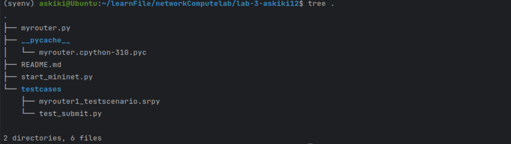
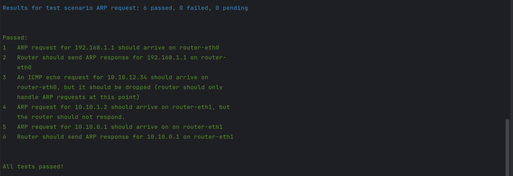
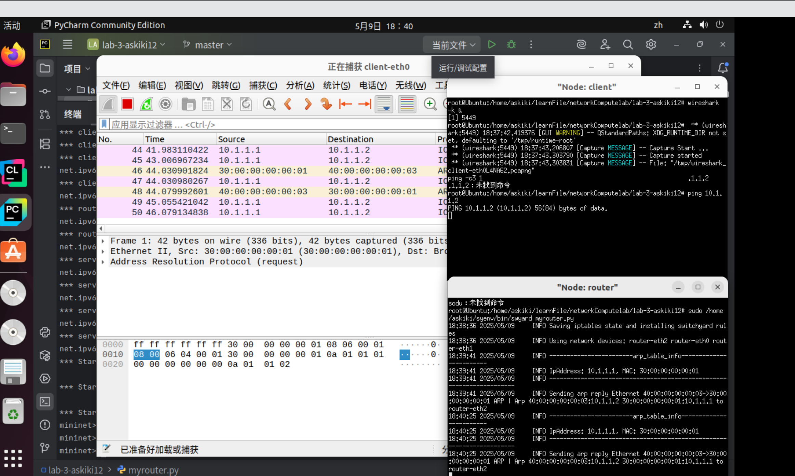
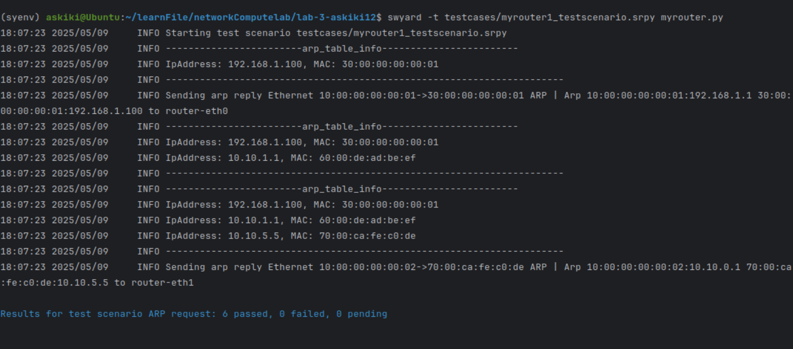

## 实验3-响应ARP

### 231880038 张国良

### 1. 实验名称

响应ARP

### 2. 实验目的

模拟响应 ARP（地址解析协议）请求，获取分配给路由器上接口的地址

### 3. 实验内容

**Task 1: Preparation**

- 下载Lab3模板代码

**Task 2: Handle ARP Requests**

- 收到报文后，根据包头判断是否是ARP包，若不是则抛弃

- 对于每个 ARP 请求，应该确定 ARP 标头中的 `targetprotoaddr` 字段（IP 地址目标）是否是分配给路由器上接口之一的 IP 地址

- 如果目标 IP 地址是分配给路由器接口的地址，则应创建并发送适当的 ARP 回复。 （如果目标 IP 地址未分配给路由器的接口之一，则不应使用 ARP 回复进行响应）

- 如果在路由器中收到的数据包不是 ARP 请求，您应该暂时忽略它（丢弃它）

- `swyard -t testcases/myrouter1_testscenario.srpy myrouter.py`测试代码
- 部署原理

**Task 3: Cached ARP Table**

- 修改 myrouter.py文件，添加cached table，更新时，打印 cached ARP table

### 4. 实验结果
克隆实验目录：

输入`swyard -t testcases/myrouter1_testscenario.srpy myrouter.py`进行测试的结果：

部署后的结果：

打印出的arp表：

### 5. 核心代码

```python
#!/usr/bin/env python3

'''
Basic IPv4 router (static routing) in Python.
'''

import time
import switchyard
from switchyard.lib.userlib import *


class Router(object):
    def __init__(self, net: switchyard.llnetbase.LLNetBase):
        self.net = net
        # other initialization stuff here
        self.interfaces = net.interfaces()
        self.arp_table = {}
        self.ip_list = []
        self.eth_list = []
        for i in self.interfaces:
            self.ip_list.append(i.ipaddr)
            self.eth_list.append(i.ethaddr)
        self.arp_timeout = 20*60

    def handle_packet(self, recv: switchyard.llnetbase.ReceivedPacket):
        timestamp, ifaceName, packet = recv
        # TODO: your logic here
        arp = packet.get_header(Arp)
        ipv4 = packet.get_header(IPv4)
        input_port = self.net.interface_by_name(ifaceName)
        if arp is not None:
            self.update_arp_table()
            self.arp_table[arp.senderprotoaddr] = [arp.senderhwaddr, time.time()]
            log_info("------------------------arp_table_info------------------------")
            for k, v in self.arp_table.items():
                log_info(f"IpAddress: {k}, MAC: {v[0]}")
            log_info("----------------------------------------------------------------------")
            if arp.operation == ArpOperation.Request:
                for i in self.ip_list:
                    if i == arp.targetprotoaddr:
                        arp_reply_pkt = create_ip_arp_reply(input_port.ethaddr, arp.senderhwaddr, arp.targetprotoaddr,
                                                            arp.senderprotoaddr)
                        self.net.send_packet(ifaceName, arp_reply_pkt)
                        log_info(f"Sending arp reply {arp_reply_pkt} to {ifaceName}")
                        return
                        
    def update_arp_table(self):
        current_time = time.time()
        for ip in list(self.arp_table.keys()):
            mac, last_update_time = self.arp_table[ip]
            if current_time - last_update_time > self.arp_timeout:
                del self.arp_table[ip]

    def start(self):
        '''A running daemon of the router.
        Receive packets until the end of time.
        '''
        while True:
            try:
                recv = self.net.recv_packet(timeout=1.0)
            except NoPackets:
                continue
            except Shutdown:
                break

            self.handle_packet(recv)

        self.stop()

    def stop(self):
        self.net.shutdown()


def main(net):
    '''
    Main entry point for router.  Just create Router
    object and get it going.
    '''
    router = Router(net)
    router.start()
```

根据要求判断是否是ARP包，若不是则抛弃，并确定 ARP 标头中的 `targetprotoaddr` 字段（IP 地址目标）是否是分配给路由器上接口之一的 IP 地址，是则回复不是则暂时忽略，同时每次收到ARP请求，更新ARP表，并打印ARP表，记录时间戳，ARP过期时间设置为20分钟。

### 6. 实验总结

本次实验我模拟了路由器中ARP的收发逻辑和表的更新逻辑，加强了我对局域网通信转发的理解