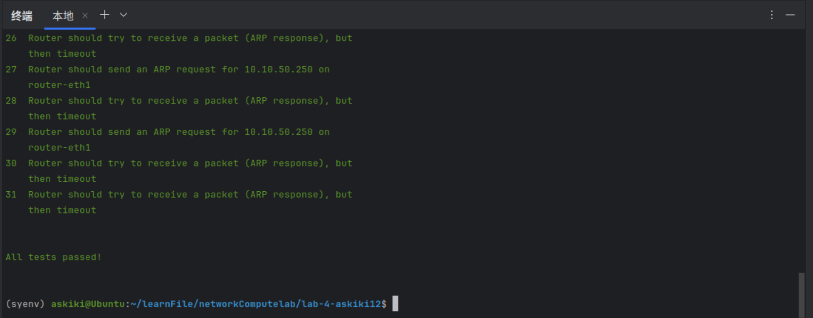
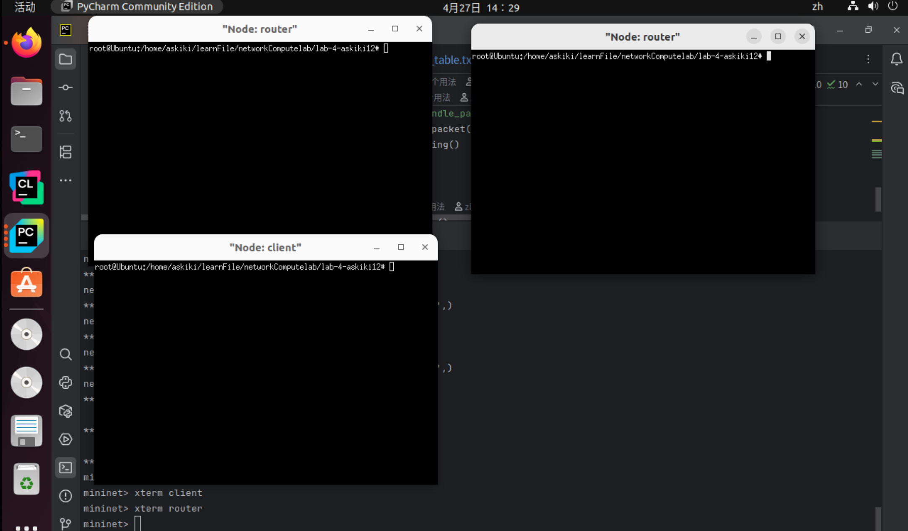
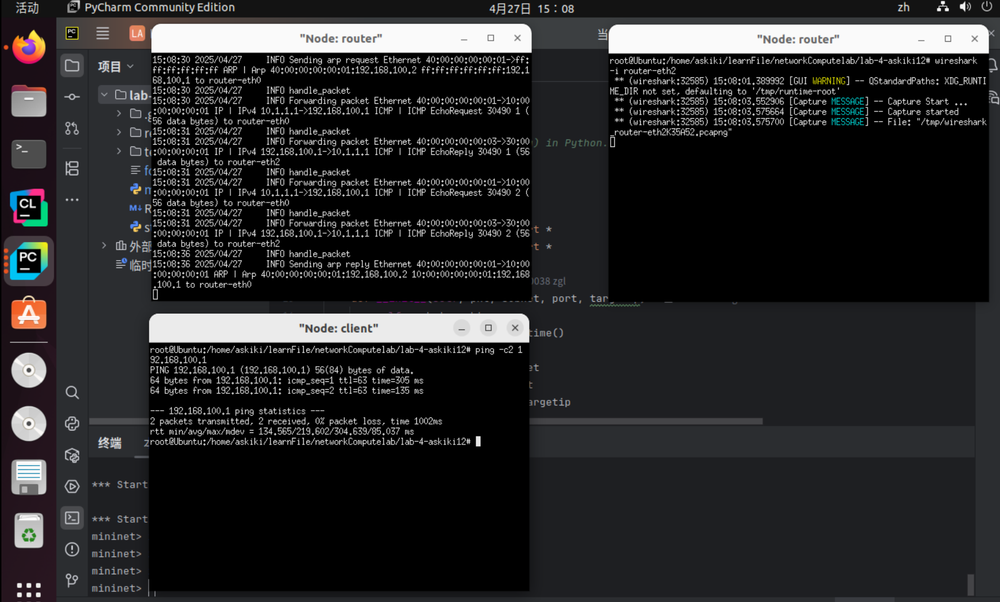
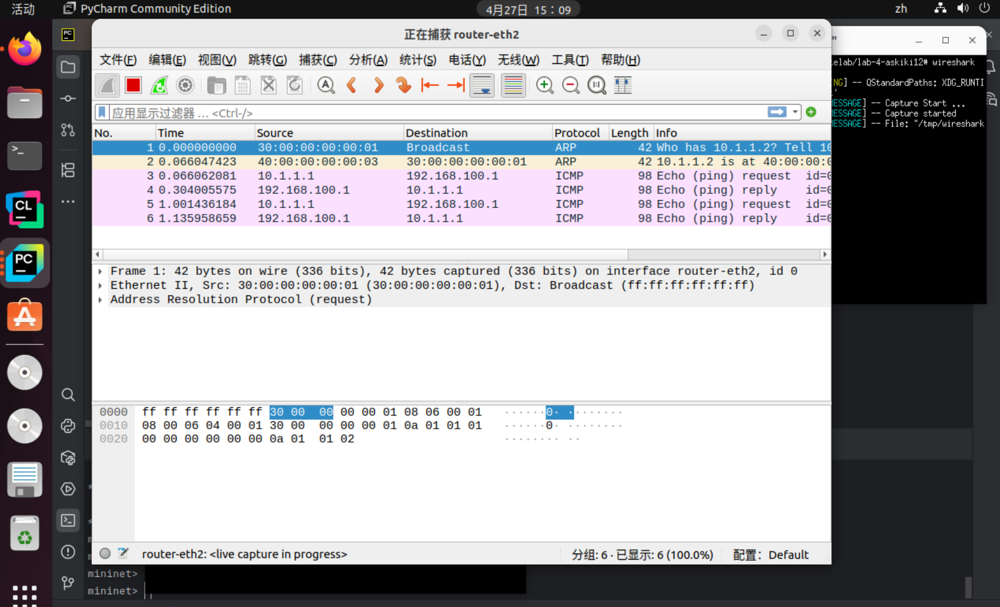

## 实验名称

**Lab 4: Forwarding Packets**

## 实验目的

模拟互联网网络中链路层ARP协议的工作过程，模拟路由对数据包的转发过程，加强对互联网通信连接的过程的理解

## 实验内容

#### 1.Handle ARP Request

- 根据包头判断是否是ARP包，若不是则抛弃
- 判断目的Ip是否在路由器端口中，若不在则抛弃
- 构造对应的ARP响应包并发送

#### 2.Cached ARP Table

- 构造一个ARP缓存表，键值对 `ip : mac , time`
- 每次收到ARP包时，将其放入ARP缓存表中
- 更新ARP缓存表，删除超时的表项

#### 3.IP Forwarding Table Lookup

- 根据`forwarding_table.txt`和路由器端口来建立路由表
- 遍历路由表项，进行最大前缀匹配，未能匹配则返回空

#### 4.Forwarding the Packet and ARP

- 收到IPv4包之后，首先判断是否为针对路由器本身的，若是则忽略
- 进行路由表最长匹配，匹配成功则将`ttl`减一
- 根据路由表匹配结果的下一跳地址，决定是否进行转发
- 对下一条地址发送ARP请求，收到ARP响应后对数据包进行封装（这里需要借助ARP Cache Table）
- 如果1s内没有收到ARP响应，则再发送一次ARP请求，至多请求5次

## 实验结果

- 输入`swyard -t testcases/testscenario2.srpy myrouter.py`进行测试：



- sudo python3 start_mininet.py
- 在mininet中xterm router并xterm client 
- Router中执行 swyard myrouter.py
- Router中同时执行 wireshark -i router-eth2
- Client中执行ping -c2 192.168.100.1 





## 核心代码

```python
#!/usr/bin/env python3

'''
Basic IPv4 router (static routing) in Python.
'''

import time
import switchyard
from switchyard.lib.userlib import *
from switchyard.lib.logging import *

class RebuildPkt:
    def __init__(self, pkt, subnet, port, targetip):
        self.packet = pkt
        self.recent_time = time.time()
        self.num_of_retries = 0
        self.match_subnet = subnet
        self.send_out_port = port
        self.targetipaddress = targetip

    def get_targetipaddress(self):
        return self.targetipaddress

    def get_send_out_port(self):
        return self.send_out_port

    def get_packet(self):
        return self.packet

    def get_num_of_retries(self):
        return self.num_of_retries

    def try_to_send(self):
        self.num_of_retries += 1

    def update_time(self):
        self.recent_time = time.time()

    def get_recent_time(self):
        return self.recent_time


class Router(object):
    def __init__(self, net: switchyard.llnetbase.LLNetBase):
        self.net = net
        # other initialization stuff here
        self.interfaces = net.interfaces()
        dir(self.interfaces[0])
        self.arp_table = {}
        self.ip_list = []
        self.eth_list = []
        for i in self.interfaces:
            self.ip_list.append(i.ipaddr)
            self.eth_list.append(i.ethaddr)
        self.forwarding_table = {}
        for i in self.interfaces:
            sub_network_address = IPv4Address(ip_address((int(i.ipaddr) & int(i.netmask))))
            self.forwarding_table[sub_network_address] = [i.netmask, '0.0.0.0', i.name]

        with open('forwarding_table.txt') as f:
            while True:
                line = f.readline()
                if not line:
                    break
                else:
                    table_info = line.split()
                    self.forwarding_table[IPv4Address(table_info[0])] = [IPv4Address(table_info[1]),
                                                                         IPv4Address(table_info[2]), table_info[3]]
        self.packet_queue = []
        self.arp_timeout = 20*60


    def handle_packet(self, recv: switchyard.llnetbase.ReceivedPacket):
        timestamp, ifaceName, packet = recv
        # TODO: your logic here
        arp = packet.get_header(Arp)
        ipv4 = packet.get_header(IPv4)
        input_port = self.net.interface_by_name(ifaceName)

        if arp is not None:
            self.update_arp_table()
            self.arp_table[arp.senderprotoaddr] = [arp.senderhwaddr, time.time()]
            if arp.operation == ArpOperation.Request:
                for i in self.ip_list:
                    if i == arp.targetprotoaddr:
                        arp_reply_pkt = create_ip_arp_reply(input_port.ethaddr, arp.senderhwaddr, arp.targetprotoaddr,
                                                            arp.senderprotoaddr)
                        self.net.send_packet(ifaceName, arp_reply_pkt)
                        log_info(f"Sending arp reply {arp_reply_pkt} to {ifaceName}")
                        return
            else:
                self.forwarding()
                return
        elif ipv4 is not None:
            if ipv4.dst in self.ip_list:
                return
            match_subnet, next_hop_ip, out_port = self.longest_prefix_match(ipv4.dst)
            if match_subnet:
                ipv4.ttl -= 1
                if ipv4.ttl <= 0:
                    return
                if next_hop_ip == '0.0.0.0':
                    dstip = ipv4.dst
                else:
                    dstip = next_hop_ip
                pkt = RebuildPkt(packet, match_subnet, out_port, dstip)
                self.packet_queue.append(pkt)
                self.forwarding()

    def update_arp_table(self):
        current_time = time.time()
        for ip in list(self.arp_table.keys()):
            mac, last_update_time = self.arp_table[ip]
            if current_time - last_update_time > self.arp_timeout:
                del self.arp_table[ip]

    def longest_prefix_match(self, dst_ip):
        best_match = None
        best_prefix_len = 0
        next_hop_ip = None
        out_port = None
        for prefix, (netmask, next_hop, port) in self.forwarding_table.items():
            net = IPv4Network(str(prefix) + '/' + str(netmask))
            if dst_ip in net:
                if net.prefixlen > best_prefix_len:
                    best_prefix_len = net.prefixlen
                    best_match = prefix
                    next_hop_ip = next_hop
                    out_port = port
        return best_match, next_hop_ip, out_port

    def forwarding(self):
        if len(self.packet_queue) == 0:
            return
        handle_pkt = self.packet_queue[0]
        targetipaddr = handle_pkt.get_targetipaddress()
        router_send_to_host_port_name = handle_pkt.get_send_out_port()
        my_packet = handle_pkt.get_packet()
        router_forwarding_port_info = self.net.interface_by_name(router_send_to_host_port_name)
        if targetipaddr in self.arp_table.keys():
            self.forwarding_packet(my_packet, router_send_to_host_port_name, targetipaddr, router_forwarding_port_info)
        elif handle_pkt.get_num_of_retries() < 5:
            self.send_arp_request(handle_pkt, router_forwarding_port_info, targetipaddr, router_send_to_host_port_name)
        elif handle_pkt.get_num_of_retries() >= 5:
            del (self.packet_queue[0])


    def forwarding_packet(self, my_packet, router_send_to_host_port_name, targetipaddr, router_forwarding_port_info):
        my_packet[Ethernet].src = router_forwarding_port_info.ethaddr
        my_packet[Ethernet].dst = self.arp_table[targetipaddr][0]
        self.net.send_packet(router_send_to_host_port_name, my_packet)
        log_info(f"Forwarding packet {my_packet} to {router_send_to_host_port_name}")
        del (self.packet_queue[0])

    def send_arp_request(self, handle_pkt, router_if, targetip, portname):
        if handle_pkt.get_num_of_retries() == 0 or (time.time() - handle_pkt.get_recent_time()) > 1.0:
            arppacket = create_ip_arp_request(
                router_if.ethaddr, router_if.ipaddr, targetip)
            handle_pkt.try_to_send()
            handle_pkt.update_time()
            self.net.send_packet(portname, arppacket)
            log_info(f"Sending arp request {arppacket} to {portname}")

    def start(self):
        '''A running daemon of the router.
        Receive packets until the end of time.
        '''
        while True:
            try:
                recv = self.net.recv_packet(timeout=1.0)
            except NoPackets:
                self.forwarding()
                continue
            except Shutdown:
                break
            log_info("handle_packet")
            self.handle_packet(recv)
            self.forwarding()

        self.stop()

    def stop(self):
        self.net.shutdown()


def main(net):
    '''
    Main entry point for router.  Just create Router
    object and get it going.
    '''
    router = Router(net)
    router.start()

```

根据实验内容和要求实现如上代码，建立并初始化转发表，构建ARP缓存表并适时更新，接收到数据包根据包头按不同逻辑处理

如果是ARP头：判断目标Ip是否是自己的Ip，如果是ARP回应，就直接转发

如果是Ip头：判断自己是否是目标路由，如果不是则按最长前缀匹配转发给下一个路由，如果最长前缀匹配到的下一跳Ip是`'0.0.0.0'`，则目标路由在自己所在的子网中，直接可以发送ARP请求

且ARP请求应该有超时重传的逻辑，最多五次

## 实验总结

在本次静态路由实验中，我基于 Switchyard 平台完成了以上过程，深入巩固了路由器的核心流程：路由决策、ARP 解析、重试与超时处理，以及队列管理，为理解静态路由器设计奠定了坚实基础。