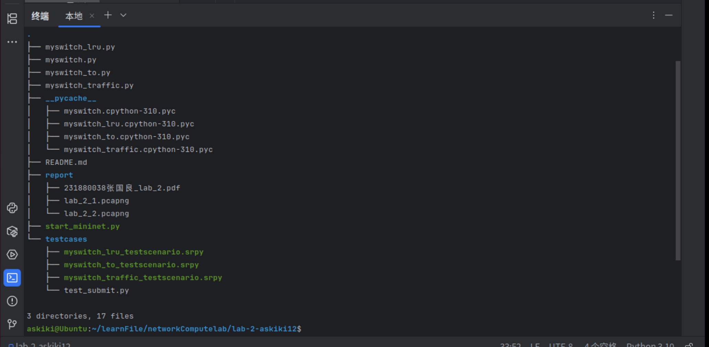
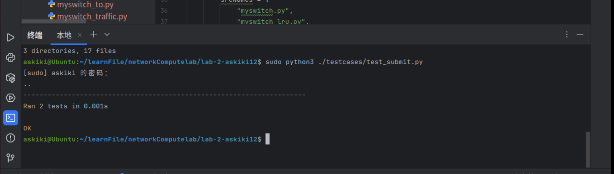
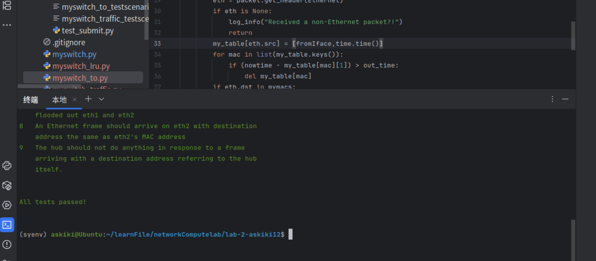
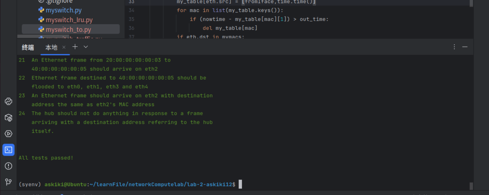
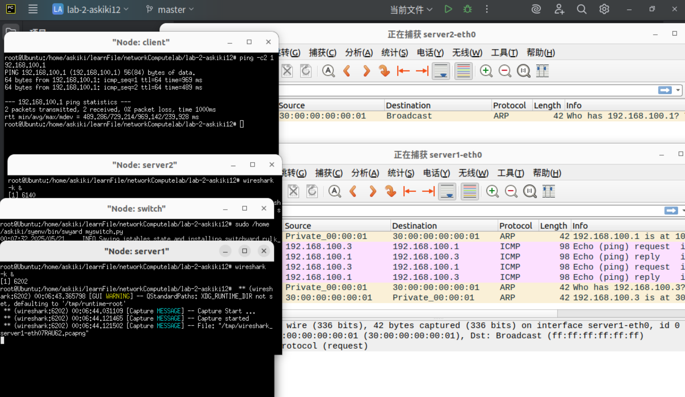

## 实验4-交换机

### 231880038 张国良

### 1. 实验名称  

实验4-交换机

### 2. 实验目的   

使用 Switchyard 框架实现以太网交换机的核心功能

交换机具有一组接口（端口），通过它们发送/接收以太网帧

当以太网帧到达任意端口时，交换机会处理帧头以获取有关目标主机的信息。 如果交换机知道可以通过其端口之一访问主机，则会从相应的输出端口发出该帧。 如果它不知道主机在哪里，则会将帧从除输入端口之外的所有端口泛洪出去

### 3. 实验内容   

#### Task 1: Prepare

- 下载实验目录

#### Task 2: Basic Switch

- 以太网学习交换机是具有一组接口（“端口”）的设备，其中链路连接到其他交换机和终端主机。 当以太网帧到达任何端口/接口时，如果交换机知道可以通过该端口访问主机，则交换机会将帧转发到适当的输出端口； 或者，如果不知道主机在哪里，则将该帧从除传入端口之外的所有端口泛洪出去
- 完成基本的交换机的功能

#### Task 3: Timeouts

- 真正的学习交换机在一段时间后会删除转发表条目，以适应网络拓扑的变化。 这里你需要在你的学习交换机中实现超时机制。 选择合理的超时值（例如 10 秒）
- 完成学习交换机的超时删除功能

#### Task 4: Least Recently Used

- 真正的学习交换机对于转发规则的存储也有限。 这里需要实现一个学习开关，它只能容纳有限数量的规则（灵活实现，以便您可以轻松更改最大规则数量）。 当您的交换机学习到新规则但没有更多空间时，您可以考虑不同的策略来逐出现有规则。 这次我们驱逐最近最少使用的规则（LRU）
- 完成学习交换机的删除最少使用功能

#### Task 5: Least Traffic Volume

- 当您的交换机需要添加新规则但没有更多空间时，我们可以逐出观察到数据包数量最少的网络流量的规则。 此外，如何计算网络流量可以通过不同的方式完成：您还可以考虑字节数或应用程序有效负载字节数（忽略较低层标头中的字节）

- 完成学习交换机的删除最小流量条目功能，和任务4类似但是算法不同

### 4. 实验结果

#### Task 1:

查看实验目录：



测试实验目录：

`sudo python3 ./testcases/test_submit.py`:



#### Task 2:

完成基础功能，利用任务345的代码一同测试

#### Task 3:

测试实验代码：

`swyard -t testcases/myswitch_to_testscenario.srpy myswitch_to.py`：



#### Task 4:

测试实验代码：

`swyard -t testcases/myswitch_lru_testscenario.srpy myswitch_lru.py`：



#### Task 5:

测试实验代码：

`swyard -t testcases/myswitch_traffic_testscenario.srpy myswitch_traffic.py`：


#### 部署工作：

```c
sudo python start_mininet.py

mininet> xterm switch

/home/njucs/.local/bin/swyard myswitch_to.py


mininet> xterm client

mininet> xterm server1

mininet> xterm server2


client> ping -c 2 192.168.100.1
```



### 5. 核心代码   

#### `myswitch.py`:

```python
'''
Ethernet learning switch in Python.

Note that this file currently has the code to implement a "hub"
in it, not a learning switch.  (I.e., it's currently a switch
that doesn't learn.)
'''
import switchyard
from switchyard.lib.userlib import *


def main(net: switchyard.llnetbase.LLNetBase):
    my_interfaces = net.interfaces()
    mymacs = [intf.ethaddr for intf in my_interfaces]
    my_table = {}

    while True:
        try:
            _, fromIface, packet = net.recv_packet()
        except NoPackets:
            continue
        except Shutdown:
            break

        log_debug (f"In {net.name} received packet {packet} on {fromIface}")
        eth = packet.get_header(Ethernet)
        if eth is None:
            log_info("Received a non-Ethernet packet?!")
            return
        my_table[eth.src] = fromIface
        if eth.dst in mymacs:
            log_info("Received a packet intended for me")
        elif eth.dst in my_table:
            net.send_packet(my_table[eth.dst], packet)
        else:
            for intf in my_interfaces:
                if fromIface!= intf.name:
                    log_info (f"Flooding packet {packet} to {intf.name}")
                    net.send_packet(intf, packet)

    net.shutdown()

```

完成基础功能，会处理帧头以获取有关目标主机的信息，学习源MAC对应接口，如果交换机知道可以通过其端口之一访问主机，则会从相应的输出端口发出该帧。 如果它不知道主机在哪里，则会将帧从除输入端口之外的所有端口泛洪出去

#### `myswitch_to.py`:

```python
'''
Ethernet learning switch in Python.

Note that this file currently has the code to implement a "hub"
in it, not a learning switch.  (I.e., it's currently a switch
that doesn't learn.)
'''
import switchyard
from switchyard.lib.userlib import *
import time


def main(net: switchyard.llnetbase.LLNetBase):
    my_interfaces = net.interfaces()
    mymacs = [intf.ethaddr for intf in my_interfaces]
    my_table = {}
    out_time = 10.0

    while True:
        try:
            _, fromIface, packet = net.recv_packet()
        except NoPackets:
            continue
        except Shutdown:
            break

        log_debug (f"In {net.name} received packet {packet} on {fromIface}")
        nowtime = time.time()
        eth = packet.get_header(Ethernet)
        if eth is None:
            log_info("Received a non-Ethernet packet?!")
            return
        my_table[eth.src] = [fromIface,time.time()]
        for mac in list(my_table.keys()):
            if (nowtime - my_table[mac][1]) > out_time:
                del my_table[mac]
        if eth.dst in mymacs:
            log_info("Received a packet intended for me")
        elif eth.dst in my_table:
            net.send_packet(my_table[eth.dst][0], packet)
        else:
            for intf in my_interfaces:
                if fromIface!= intf.name:
                    log_info (f"Flooding packet {packet} to {intf.name}")
                    net.send_packet(intf, packet)

    net.shutdown()

```

增加超时功能，收到帧头时候检测删除超时条目，其他功能不变

#### `myswitch_lru.py`:

```python
'''
Ethernet learning switch in Python.

Note that this file currently has the code to implement a "hub"
in it, not a learning switch.  (I.e., it's currently a switch
that doesn't learn.)
'''
import switchyard
from switchyard.lib.userlib import *


def main(net: switchyard.llnetbase.LLNetBase):
    my_interfaces = net.interfaces()
    mymacs = [intf.ethaddr for intf in my_interfaces]
    my_table = {}
    maxnum = 4

    while True:
        try:
            _, fromIface, packet = net.recv_packet()
        except NoPackets:
            continue
        except Shutdown:
            break

        log_info (f"In {net.name} received packet {packet} on {fromIface}")
        eth = packet.get_header(Ethernet)
        for mac in my_table.keys():
            my_table[mac][1] += 1
        if eth is None:
            log_info("Received a non-Ethernet packet?!")
            return
        if eth.dst in mymacs:
            log_info("Received a packet intended for me")
        else:
            if eth.src in my_table.keys():
                if fromIface != my_table[eth.src][0]:
                    my_table[eth.src][0] = [fromIface]
            else:
                if len(my_table) < maxnum:
                    my_table[eth.src] = [fromIface, 0]
                    log_info("*******************************")
                    for key in my_table.keys():
                        log_info(f"{key}:{my_table[key][0]}")
                    log_info("*******************************")
                else:
                    lru_key = list(my_table.keys())[0]
                    for key in my_table.keys():
                        if my_table[key][1] > my_table[lru_key][1]:
                            lru_key = key
                    del my_table[lru_key]
                    my_table[eth.src] = [fromIface, 0]
                    log_info("**************full*************")
                    for key in my_table.keys():
                        log_info(f"{key}:{my_table[key][0]}")
                    log_info("*******************************")
            if eth.dst in my_table.keys():
                log_info(f"Sending packet {packet} to {my_table[eth.dst][0]}")
                my_table[eth.dst][1] = 0
                net.send_packet(my_table[eth.dst][0], packet)
            else:
                for intf in my_interfaces:
                    if fromIface!= intf.name:
                        log_info (f"Flooding packet {packet} to {intf.name}")
                        net.send_packet(intf, packet)

    net.shutdown()

```

- 增加删除最近少用功能，利用最近少用算法收到帧时检测源MAC是否在表中

- 如果在则更新相关信息，如果不在检测是否到达容量到达则删除最近少用并添加新条目，否则之间添加

- 转发到目的MAC也要更新相关最近少用信息

#### `myswitch_traffic.py`:

```python
'''
Ethernet learning switch in Python.

Note that this file currently has the code to implement a "hub"
in it, not a learning switch.  (I.e., it's currently a switch
that doesn't learn.)
'''
import switchyard
from switchyard.lib.userlib import *


def main(net: switchyard.llnetbase.LLNetBase):
    my_interfaces = net.interfaces()
    mymacs = [intf.ethaddr for intf in my_interfaces]
    my_table = {}
    maxnum = 4

    while True:
        try:
            _, fromIface, packet = net.recv_packet()
        except NoPackets:
            continue
        except Shutdown:
            break

        log_info (f"In {net.name} received packet {packet} on {fromIface}")
        eth = packet.get_header(Ethernet)
        if eth is None:
            log_info("Received a non-Ethernet packet?!")
            return
        if eth.dst in mymacs:
            log_info("Received a packet intended for me")
        else:
            if eth.src in my_table.keys():
                if fromIface != my_table[eth.src][0]:
                    my_table[eth.src][0] = [fromIface]
            else:
                if len(my_table) < maxnum:
                    my_table[eth.src] = [fromIface, 0]
                    log_info("*******************************")
                    for key in my_table.keys():
                        log_info(f"{key}:{my_table[key][0]}")
                    log_info("*******************************")
                else:
                    target_key = list(my_table.keys())[0]
                    for key in my_table.keys():
                        if my_table[key][1] < my_table[target_key][1]:
                            target_key = key
                    del my_table[target_key]
                    my_table[eth.src] = [fromIface, 0]
                    log_info("**************full*************")
                    for key in my_table.keys():
                        log_info(f"{key}:{my_table[key][0]}")
                    log_info("*******************************")
            if eth.dst in my_table.keys():
                log_info(f"Sending packet {packet} to {my_table[eth.dst][0]}")
                my_table[eth.dst][1] += 1
                net.send_packet(my_table[eth.dst][0], packet)
            else:
                for intf in my_interfaces:
                    if fromIface!= intf.name:
                        log_info (f"Flooding packet {packet} to {intf.name}")
                        net.send_packet(intf, packet)

    net.shutdown()

```

类似任务4中代码任务，算法稍有不同，这一任务中删除的条目是流量最少的，所以记录流量即可

### 6. 实验总结

深入学习了学习交换机的工作过程，部署直观认识工作结果，拓展学习了学习交换机的其他功能，尝试实现加深了理解