# 计网复习

总览

## 一、计算机网络和因特网

### （一）什么是主机/端系统、分组、协议？

1. **主机 / 端系统（Hosts/End Systems）**
   指连接到互联网的计算设备，如个人电脑、手机等，用于运行网络应用程序（如 Web 浏览器、电子邮件客户端），是网络服务的消费者或提供者。
2. **分组（Packets）**
   主机将应用层消息分割成的较小数据单元，包含目的地地址，通过路由器在网络中逐跳转发。
3. **协议（Protocols）**
   定义网络实体间通信规则的标准，规定消息的格式、传输顺序及响应动作。例如，HTTP 用于 Web 通信，TCP/IP 负责端到端传输和路由，Ethernet 规范局域网数据链路层交互。

### （二）客户、服务器？

1. **客户（Client）**
   在客户 / 服务器模型中，主动发起服务请求的主机，通常为短暂在线的终端设备（如浏览器），依赖服务器提供资源或功能。
2. **服务器（Server）**
   持续在线的主机，用于响应客户请求并提供服务（如 Web 服务器存储网页、邮件服务器管理邮箱），具有固定 IP 地址和高性能硬件。

### （三）电路交换和分组交换的对比？

| **特性**         | **电路交换**                                           | **分组交换**                                         |
| ---------------- | ------------------------------------------------------ | ---------------------------------------------------- |
| **连接方式**     | 通信前需建立专用物理连接（如电话网），通信期间独占资源 | 无需预建连接，数据分割为分组独立路由，共享网络资源   |
| **资源分配**     | 静态分配，效率低（尤其在突发流量时）                   | 动态统计复用，资源利用率高                           |
| **时延与可靠性** | 低时延、无排队，但建立连接耗时，故障会中断通信         | 存在排队时延和丢包可能，但鲁棒性强（可绕行故障路径） |
| **典型应用**     | 传统电话网络、实时音视频（需固定带宽）                 | 互联网（Web、邮件、文件传输等）                      |

### （四）节点处理时延、排队时延、传输时延、传播时延、吞吐量

1. **处理时延（Processing Delay）**
   路由器或交换机处理分组头部、检查错误或确定转发路径的时间，通常可忽略。
2. **排队时延（Queuing Delay）**
   分组在路由器缓冲区中等待转发的时间，取决于链路繁忙程度：网络空闲时趋近于零，拥塞时可能显著增加。
3. **传输时延（Transmission Delay）**
   将分组所有比特推送到链路所需的时间，计算公式为：`分组大小（比特）/ 链路传输速率（bps）`，与链路带宽成反比。
4. **传播时延（Propagation Delay）**
   比特在物理链路上从一端传播到另一端的时间，计算公式为：`链路长度 / 信号传播速度`，取决于介质特性（如光纤 vs. 双绞线）。
5. **吞吐量（Throughput）**
   单位时间内通过网络传输的数据量，分为**即时吞吐量**（某时刻速率）和**平均吞吐量**（整体传输速率），受限于路径中的瓶颈链路。

**吞吐量是除以总时间**

### （五）5 层因特网协议栈及每层作用

#### **TCP/IP 协议栈（5 层模型）**

| **层次**   | **作用**                                                     | **数据单元**       | **关键协议 / 技术**           |
| ---------- | ------------------------------------------------------------ | ------------------ | ----------------------------- |
| **应用层** | 为用户提供直接服务，处理特定网络应用（如 Web、邮件、文件传输） | 报文（Message）    | HTTP、SMTP、FTP、DNS          |
| **运输层** | 实现端到端进程间数据传输，提供可靠（TCP）或无连接（UDP）服务 | 报文段（Segment）  | TCP、UDP                      |
| **网络层** | 负责分组在多个网络间的路由与转发，定义 IP 地址和路由协议     | 数据报（Datagram） | IP、RIP、OSPF                 |
| **链路层** | 在相邻节点间传输数据帧，处理物理寻址、错误检测和介质访问（如 CSMA/CD） | 帧（Frame）        | Ethernet、PPP、802.11（WiFi） |
| **物理层** | 定义物理介质的电气 / 机械特性，实现比特流的透明传输          | 比特（Bit）        | 双绞线、光纤、无线电波        |

#### **术语对应关系**

- **应用层**：产生 “报文”（如 HTTP 请求 / 响应）
- **运输层**：将报文分割为 “报文段”（TCP/UDP 封装）
- **网络层**：为报文段添加 IP 头部，形成 “数据报”
- **链路层**：将数据报封装为 “帧”（添加 MAC 地址和校验信息）

### 课后习题：

**电路交换：**由于电路交换在通信之前要在通信双方之间建立一条被双方独占的物理通 路（由通信双方之间的交换设备和链路逐段连接而成）。因而有以下优点： （1）由于通信线路为通信双方用户专用，数据直达，所以传输数据的时延非常小 
（2）通信双方之间的物理通路一旦建立，双方可以随时通信，实时性强。 （3）双方通信时按发送顺序传送数据，不存在失序问题。 
（4）电路交换既适用于传输模拟信号，也适用于传输数字信号。
（5）电路交换设备控制均较简单。

**TDM比FDM的优点如下：** 

1. 当发生拥塞等网络问题时，TDM中的数据丢失可能只会是一部分，而FDM中就可能是大部分或全部。 
2. TDM适合数字信号传输，而FDM适合模拟信号传输，因为现在通信网络多是传输数字信号，所以TDM比FDM好。 
3. 因为频分复用连接建立后，当中途没有数据传输时，他所占有的频段带宽不能被其 他连接使用，故可能存在空置，而在时分复用的统计时分模式下，连接建立后，当某个连接暂时不用传输数据时可以少分时间片或者不分，即其时隙的分配时“按需分 配”，这样就让出了相应的传输时间给其他连接。

## 二、应用层

### （一）客户-服务器体系结构、对等体系结构？

- **客户 - 服务器体系结构（Client-Server Paradigm）**
  客户 - 服务器模型中，服务器是始终在线的主机，拥有固定 IP 地址，负责提供服务（如 Web 服务器发送网页、邮件服务器处理邮件）；客户是主动发起请求的主机，通常为临时在线设备（如浏览器、邮件客户端），通过动态 IP 地址与服务器通信。通信过程中，客户 “先发言”，服务器响应请求。
  *示例*：Web 浏览（浏览器请求服务器返回网页）、电子邮件（客户端发送邮件到服务器）
- **对等体系结构（Peer-to-Peer Paradigm, P2P）**
  无始终在线的服务器，任意端系统（对等节点）直接通信，每个节点既请求服务，也提供服务。节点可间歇性连接且 IP 地址动态变化，具有自扩展性（新节点加入同时增加服务能力和需求），但管理难度高。
  *示例*：BitTorrent（文件共享）、Skype（语音通话，部分场景需中央服务器辅助寻址）

### （二）TCP和UDP的区别？

- **TCP（传输控制协议）**：面向连接，提供可靠数据传输（确认机制、流量控制、拥塞控制），传输前需三次握手建立连接，适用于对可靠性要求高的场景（如 HTTP、SMTP）。
- **UDP（用户数据报协议）**：无连接，不可靠传输（无确认机制），延迟低、开销小，适用于实时性要求高的场景（如 DNS 查询、视频流）。
  *注：文档中 HTTP 基于 TCP（），DNS 使用 UDP（）可间接佐证两者应用差异。*

### （三）什么是HTTP？HTTP的请求-响应行为？URL由哪两部分组成？

1. **HTTP（超文本传输协议）**
   应用层协议，基于客户 - 服务器模型，用于 Web 内容传输。特点包括：
   - 运行于 TCP 端口 80，支持持久连接（HTTP/1.1 默认）和流水线请求。
   - 无状态（服务器不保留会话状态，通过 Cookie 机制弥补）。
   - 请求方法包括 GET（获取资源）、POST（提交数据）、PUT（上传文件）、DELETE（删除资源）等。
2. **请求 - 响应行为**
   - **客户发起请求**：请求消息包含请求行（方法、资源路径、协议版本）、头部字段（如 Host、User-Agent）和可选主体（如 POST 提交的数据）。
     *示例*：`GET /somedir/page.html HTTP/1.1 Host: www.someschool.edu`。
   - **服务器返回响应**：响应消息包含状态行（协议版本、状态码、状态短语）、头部字段（如 Date、Server）和主体（如 HTML 内容）。
     *示例*：`HTTP/1.1 200 OK Content-Type: text/html`。
3. **URL 组成**
   统一资源定位符（URL）由两部分组成：
   - **协议部分**：指定传输协议（如 http、ftp）。
   - **资源路径部分**：包含主机名（或 IP 地址）、端口号（默认可省略）、文件路径和查询参数。
     *格式*：`<protocol>://<host>:<port>/<path>?query_string`，示例：`http://www.nju.edu.cn:8080/somedir/page.htm`。

HTTP 是web交换信息的协议，客户端与服务器之间，交换的信息内容是UPL和HTML

URL：

HTTP 中文名超文本传输协议，用于客户端-服务器架构，服务器始终在线且众所周知

问题 无法保存网页状态，如购物车

解决方案：Cookies

HTTP的性能：

另一个设计——缓存：

- 减少网络延迟 如将访问的资源储存在用户更近的位置
- 降低负载
- 应对网络堵塞

缺点：缓存污染——代码更新，仍从缓存读取；一致性问题

缓存——在哪里？

浏览器、向前代理、反向代理、内容分销网络

### （四）因特网电子邮件的三个组成部分？每部分的主要作用？

1. **用户代理（User Agent, UA）**
   - **作用**：提供用户与邮件系统的交互界面，用于撰写、编辑、阅读邮件，以及与邮件服务器通信。
   - *示例*：Outlook、Foxmail、Gmail 网页端。
2. **邮件服务器（Mail Servers）**
   - 作用：
     - **发送服务器（SMTP 服务器）**：接收用户代理发送的邮件，通过 SMTP 协议中继至目标服务器。
     - **接收服务器（POP/IMAP 服务器）**：存储用户邮件，供用户通过 POP3 或 IMAP 协议检索。
   - *关键概念*：邮箱（存储收件）、消息队列（暂存待发送邮件）。
3. **邮件协议**
   - **SMTP（简单邮件传输协议）**：用于邮件从用户代理到服务器、服务器到服务器的传输，基于 TCP 连接，采用命令 - 响应模式。
   - **POP3/IMAP**：用于用户从服务器检索邮件，POP3 为下载后删除模式，IMAP 支持服务器端邮件管理。

过程：

### （五）SMTP的基本操作？（A向B发送一条报文的过程）

1. **第一阶段：用户代理发送邮件至本地 SMTP 服务器**
   - A 通过用户代理撰写邮件，指定收件人 B 的邮箱地址（如 bob@someschool.edu）。
   - 用户代理作为 SMTP 客户端，与本地 SMTP 服务器建立 TCP 连接（端口 25），通过 SMTP 命令（如 MAIL FROM、RCPT TO、DATA）将邮件内容发送至服务器，邮件暂存于服务器的消息队列。
2. **第二阶段：本地 SMTP 服务器中继邮件至远程 SMTP 服务器**
   - 本地服务器作为 SMTP 客户端，解析收件人域名（someschool.edu）对应的 IP 地址（通过 DNS 查询），与远程 SMTP 服务器建立 TCP 连接。
   - 通过 SMTP 协议将邮件传输至远程服务器，远程服务器将邮件存入 B 的邮箱。
3. **第三阶段：B 通过用户代理检索邮件**
   - B 启动用户代理，通过 POP3 或 IMAP 协议与远程 SMTP 服务器建立连接，认证后下载或管理邮件。

### （六）推协议、拉协议？

- **推协议（Push Protocol）**
  发送方主动将数据 “推” 至接收方，无需接收方预先请求。
  *示例*：SMTP 协议中邮件服务器将邮件推送给收件人服务器。
- **拉协议（Pull Protocol）**
  接收方主动 “拉取” 数据，发送方仅在收到请求后响应。
  *示例*：HTTP 协议中浏览器向服务器请求网页。

### （七）域名系统的作用？DNS服务器的层次结构？DNS中的递归查询和迭代查询？

1. **作用**
   将人类可读的域名（如[www.baidu.com](https://www.baidu.com/)）映射为机器可识别的 IP 地址，实现网络设备的寻址。
2. **DNS 服务器层次结构**
   - **根域名服务器（Root Name Servers）**：全球约 13 组，负责返回顶级域名（TLD）服务器的 IP 地址，如.com、.edu 的服务器地址。
   - **顶级域名服务器（TLD Servers）**：负责特定顶级域名的解析，如 Network Solutions 管理.com 域，Educause 管理.edu 域。
   - **权威域名服务器（Authoritative Servers）**：由组织机构自行维护，提供该机构域名与 IP 的映射（如南京大学的域名服务器解析[nju.edu.cn](https://nju.edu.cn/)相关地址）。
   - **本地域名服务器（Local Servers）**：由 ISP 或企业维护，作为用户查询的第一站，缓存近期解析结果以加速查询。
3. **递归查询和迭代查询**
   - **递归查询（Recursive Query）**：用户向本地服务器发起查询，本地服务器负责全程解析（可能递归调用其他服务器），最终返回结果给用户。
     *示例*：主机查询 gaia.cs.umass.edu 的 IP，本地服务器向根服务器、TLD 服务器、权威服务器逐级查询。
   - **迭代查询（Iterative Query）**：服务器收到查询后，返回下一个可查询的服务器地址，由客户端或本地服务器自行后续查询。
     *示例*：根服务器收到查询后，返回对应的 TLD 服务器地址，由本地服务器继续向 TLD 服务器查询。

其他协议介绍：

内容分发网络：（tiktok）

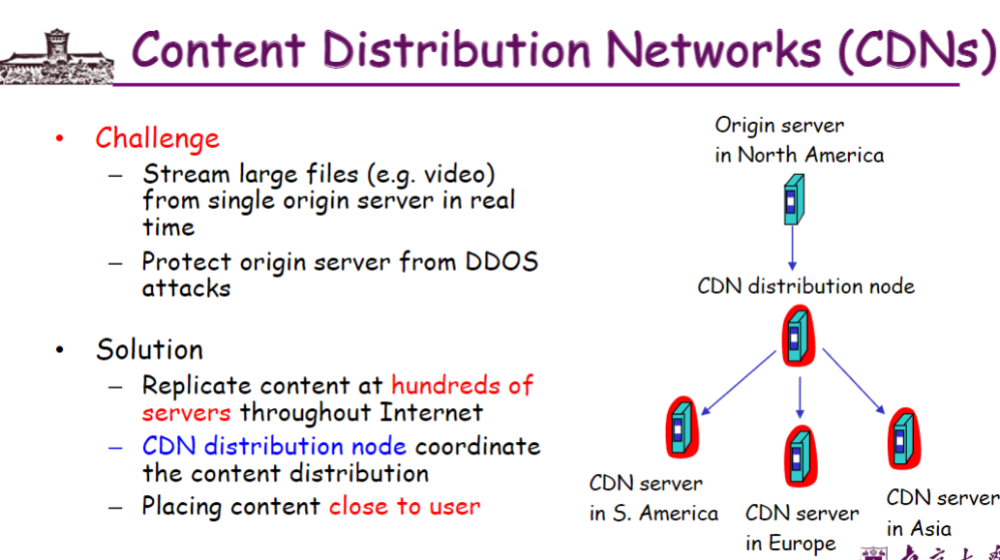

### 课后习题：

## 三、运输层

TCP处理错误数据包——ack

如果ack损坏？——序列号

处理数据包丢失——超时重传

处理ack丢失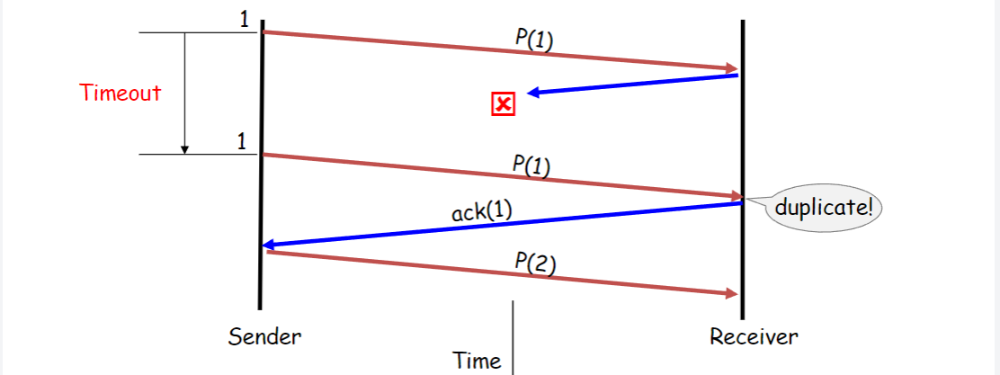

计时器操控的重传可能造成数据包重复

实现上述要求的结构：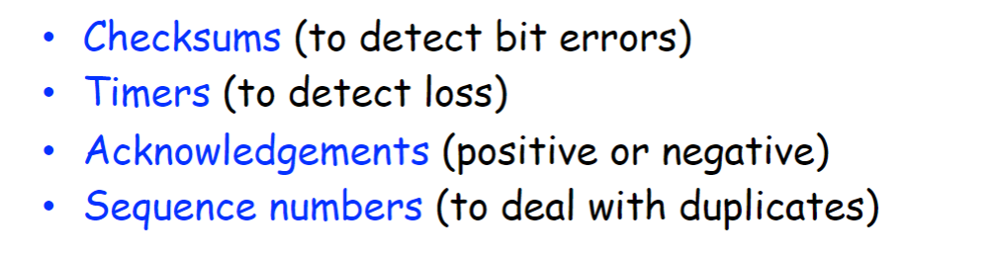

问题：

停止等待协议是低效的

解决方案——流水线

增加机制——滑动窗口

**停止等待协议与滑动窗口（流水线）吞吐量相比：**

回答两个问题：

**此时ack应该是什么样子的？**（接收方如何确认数据包）

**1.累计确认，ack携带接收方期待的下一个序列号**

**2.选择性确认，ack单独确认正确接受的数据包**

- 提供更加精确的信息但是需要更复杂的记录工作

**此时发送方是什么样子的？**

**1.回退N步（Go-Back-N）**

**2.选择重传（SR）**

[数据链路层传输协议（点到点）：停等协议、GBN、SR协议 - 子酱 - 博客园](https://www.cnblogs.com/toonezhr/p/17773565.html)

UDP和TCP：

UDP，无连接，无序交付，追求速率，校验和检验：

TCP，可靠连接，丢失重发，顺序交付

TCP引入

- 校验和
- 序列号机制
- 接收方累计确认（类似GBN）
- 接收方缓存乱序数据包（类似SR）
- 引入快速重传处理丢失，3个重复的ack
- 维持单一重传定时器，类似GBN，超时重传

超时定时器时长的选择：

解决：RTT样本指数加权平均值

可靠连接：

释放连接

可变的滑动窗口：

TCP Tahoe和TCP Reno对于出现**三个冗余ack**表现的不同：

TCP CUBIC：

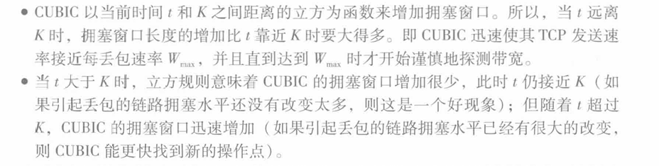

TCP吞吐量的宏观描述：

W——丢包时候的窗口长度

### （一）运输层的多路复用与多路分解？

- **多路复用（Multiplexing）**：发送方运输层将多个应用进程的数据封装到不同的传输层分组（如 TCP/UDP 段）中，并统一交给网络层传输。
- **多路分解（Demultiplexing）**：接收方运输层根据传输层分组中的源 / 目的端口号、IP 地址等信息，将数据正确分发给对应的应用进程。

### （二）UDP套接字？TCP套接字？

- **UDP 套接字**：由**本地 IP 地址 + 本地端口号**唯一标识，无连接状态，每个 UDP 数据报独立处理
- **TCP 套接字**：由 **四元组（源 IP、源端口、目的 IP、目的端口）** 标识，面向连接，需维护连接状态（如序列号、确认号）

### （三）为什么有些应用更适合用UDP？UDP中的检验和计算？

**适用场景**：

- **低延迟、容忍丢包的应用**（如流媒体、DNS、实时游戏）：UDP 无连接建立开销，传输速度快，适合对实时性要求高的场景。
- **无需可靠传输**：应用层可自行处理可靠性（如视频流通过时间戳容错）。

**检验和计算**：

- 发送方将 UDP 段（包括伪首部、首部、数据）视为 16 位字序列，计算反码求和，结果存入检验和字段；接收方重复计算并验证和是否为全 1。

### （四）TCP的肯定确认、否定确认、自动重选请求协议？

- **肯定确认（ACK）**：接收方收到正确数据后，发送 ACK 确认，序号为期望接收的下一字节。
- **否定确认（NACK）**：TCP 未显式实现 NACK，通过重复 ACK（DupACK）暗示分组丢失。
- **自动重传**：发送方超时未收到 ACK 则重传数据，使用滑动窗口和序列号确保顺序性。
  **依据**：

### （五）停等协议、比特交替协议的基本原理？

**停等协议（Stop-and-Wait）**：

- 发送方每次仅发送一个分组，等待接收方 ACK 确认后再发送下一个；若超时未收到 ACK 则重传。
- **效率问题**：信道利用率极低，仅适用于低带宽、高 RTT 场景。

**比特交替协议（隐含于停等协议）**：

- 通过**0/1 交替序号**避免重复分组，接收方通过序号判断是否为重复分组。

### （六）回退N步、选择重传的基本原理？

**回退 N 步（GBN）**：

- 发送方维护发送窗口，允许连续发送 N 个分组；接收方仅接收有序分组，丢失或失序时丢弃后续分组，发送重复 ACK。
- 发送方超时后，重传窗口内所有未确认分组。

**选择重传（SR）**：

- 发送方和接收方均维护滑动窗口，接收方对每个正确分组单独 ACK，并缓存失序分组；发送方仅重传丢失的分组。
- **避免窗口溢出**：窗口大小需≤序号空间的一半。
  **依据**：

### （七）什么是流量控制、拥塞控制？

**流量控制（Flow Control）**：

- 发送方根据接收方的接收能力（通告窗口 RWND）调整发送速率，避免接收方缓冲区溢出。
- **实现**：TCP 通过滑动窗口和 ACK 中的 RWND 字段动态调节。

**拥塞控制（Congestion Control）**：

- 全局机制，防止网络中分组过载。TCP 通过慢启动、拥塞避免、快速恢复等算法调整拥塞窗口（CWND），探测网络可用带宽。

### （八）TCP的3次握手？

1. **第一次握手**：客户端发送 SYN 段（序号 Seq=x），请求建立连接。
2. **第二次握手**：服务器回复 SYN-ACK 段（Seq=y，Ack=x+1），确认客户端请求。
3. **第三次握手**：客户端发送 ACK 段（Seq=x+1，Ack=y+1），连接建立完成。
   **作用**：

- 同步初始序列号（ISN），避免历史连接干扰。
- 确保双向通信可达。

### （九）TCP拥塞控制方法：慢启动、拥塞避免、快速恢复？

**慢启动（Slow Start）**：

- 初始拥塞窗口（CWND）=1 MSS，每收到一个 ACK，CWND+1（指数增长），直至达到慢启动阈值（ssthresh）或发生丢包。
- **目标**：快速探测网络可用带宽。

**拥塞避免（Congestion Avoidance）**：

- 当 CWND≥ssthresh 时，进入线性增长阶段（每 RTT 增加 1 MSS），避免网络拥塞。
- **调整策略**：丢包时，ssthresh=CWND/2，CWND=1，重新慢启动。

**快速恢复（Fast Recovery）**：

- 收到 3 个重复 ACK 时，认为分组丢失但网络仍可传输，ssthresh=CWND/2，CWND=ssthresh+3 MSS，线性增长直至新 ACK 到达。

### 课后习题

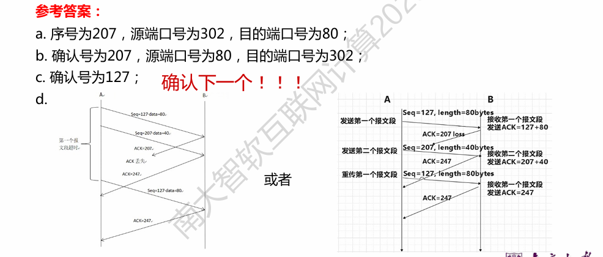

## 四、网络层：数据平面

数据平面和控制平面：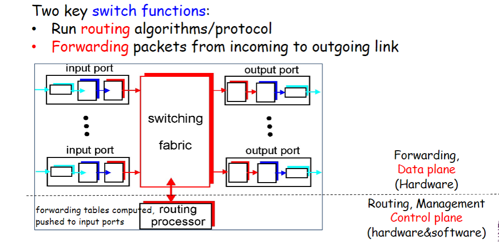

每个输出端口的聚合映射，最长前缀匹配：

三种交换技术：

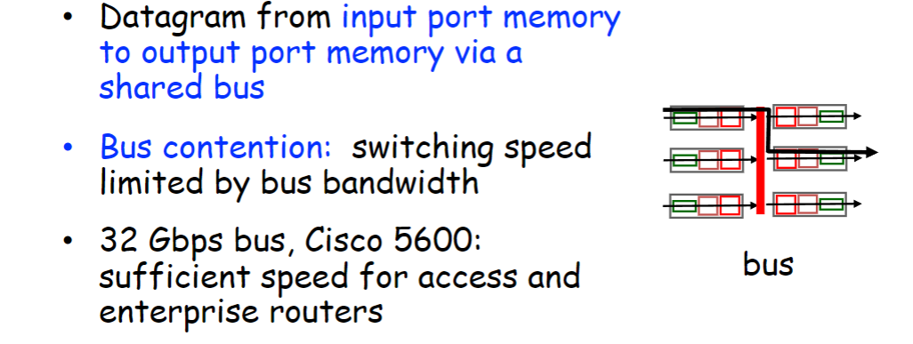

IPv4：

每个地址：全零和全1，特殊作用，网络号和广播号

流表抽象：

### （一）数据平面、控制平面的主要作用？转发、路由选择？

**数据平面作用**：负责单个路由器内的分组处理，包括从输入端口接收分组、查找转发表确定输出端口、执行分组转发，并处理队列管理、错误检测等局部操作。
**控制平面作用**：负责全局的路由计算和路径选择，通过路由算法生成转发表，确保分组从源到目的的端到端路径优化。
**转发与路由选择区别**：

- **转发（Forwarding）**：基于转发表将分组从输入端口导向输出端口，是数据平面的局部操作。
- **路由选择（Routing）**：通过算法（如 Dijkstra）计算分组的端到端路径，更新转发表，是控制平面的全局逻辑。

### （二）路由器的4个组件？

1. **输入端口（Input Port）**：处理物理层接收、数据链路层解封装，执行最长前缀匹配查找输出端口，并管理输入队列。
2. **输出端口（Output Port）**：负责数据链路层封装和物理层传输，执行分组调度和缓存管理。
3. **交换结构（Switching Fabric）**：连接输入与输出端口，实现分组在路由器内部的传输，支持内存交换、总线交换或交叉矩阵交换。
4. **路由处理器（Routing Processor）**：运行路由协议，维护路由表和转发表，协调控制平面与数据平面。

### （三）路由器中的最长前缀匹配规则？

路由器在转发分组时，通过匹配目的 IP 地址的最长前缀来确定输出端口。例如，若转发表中有前缀`110000**`（端口 1）和`11000011`（端口 2），当收到目的地址`1100001101`时，匹配最长前缀`11000011`（8 位），选择端口 2。
该规则通过树状数据结构（如二叉树）优化查找效率，避免遍历所有条目。

### （四）三种交换技术？

1. **通过内存交换（Memory-Based Switching）**：分组从输入端口存入内存，由 CPU 控制转发至输出端口，速度受内存带宽限制，适用于早期路由器。
2. **通过总线交换（Bus-Based Switching）**：分组通过共享总线传输，同一时刻仅支持单分组传输，存在总线竞争，适用于中小型路由器。
3. **通过交叉矩阵交换（Crossbar Switching）**：基于硬件矩阵实现并行传输，输入与输出端口通过交叉点直接连接，支持高带宽并发交换，适用于核心路由器。

### （五）分组调度：先进先出、优先权排队、循环和加权公平排队？

1. **先进先出（FIFO）**：分组按到达顺序处理，先入队先传输，实现简单但不区分优先级，可能导致长分组阻塞短分组。
2. **优先权排队（Priority Scheduling）**：将分组分为不同优先级队列（如语音、数据），每次优先传输高优先级队列中的分组，可能导致低优先级饥饿。
3. **循环调度（Round Robin, RR）**：轮流从各队列取一个分组传输，确保各队列公平共享带宽，适用于多类流量均分场景。
4. **加权公平排队（Weighted Fair Queuing, WFQ）**：为每个队列分配权重，按权重比例分配传输资源，保证最小带宽预留，例如权重为 2 的队列获得两倍于权重为 1 队列的传输机会。

### （六）IPv4编址：二进制/十进制IP地址、子网、无类别域间路由选择？

- **二进制 / 十进制 IP 地址**：32 位二进制数，通常以点分十进制表示（如`223.1.1.1`对应`11011111.00000001.00000001.00000001`），分为网络部分和主机部分。
- **子网（Subnetting）**：将主机部分划分为子网号和主机号，通过子网掩码（如`255.255.255.0`）标识网络 / 子网边界。例如，`141.14.2.0/24`表示子网号为前 24 位，主机号 8 位。
- **无类别域间路由（CIDR）**：使用`/n`表示前缀长度，替代传统分类编址。例如，`10.217.112.0/20`表示前 20 位为网络前缀，支持路由聚合（如将多个连续子网合并为一个前缀）。

### （七）动态主机配置协议的工作原理？

1. **客户端广播发现（DHCP Discover）**：主机发送广播包寻找 DHCP 服务器。
2. **服务器响应提供（DHCP Offer）**：服务器返回可用 IP 地址、子网掩码、租期等信息。
3. **客户端请求（DHCP Request）**：主机选择一个服务器并请求分配该地址。
4. **服务器确认（DHCP Ack）**：服务器确认分配，主机正式获取地址。
   过程中使用 UDP 端口 67（服务器）和 68（客户端），支持地址续租和释放。

提供更多信息：

### （八）网络地址转换的工作原理？

NAT 允许内部网络使用私有 IP 地址（如`10.0.0.0/8`）通过公网 IP 访问互联网，通过转换表映射内部与外部地址：

- **正向转换**：内部主机发送分组时，NAT 路由器将源 IP（私有）替换为公网 IP，并记录端口映射（如`10.1.1.1:3345 → 192.168.2.2:5001`）。
- **反向转换**：外部响应分组到达时，NAT 根据端口映射还原目标私有 IP。
  优点包括节省公网 IP、隐藏内部拓扑，但可能导致应用层协议（如 FTP）兼容性问题。

### （九）IPv4向IPv6迁移中采用的建隧道方法？

隧道技术将 IPv6 分组封装在 IPv4 数据报中，通过 IPv4 网络传输，步骤如下：

1. **封装**：IPv6 分组作为负载放入 IPv4 数据报的 payload，外层 IP 头的协议字段设为 41（标识内层为 IPv6）。
2. **传输**：IPv4 网络透明传输该数据报，无需识别内层 IPv6 内容。
3. **解封装**：到达支持 IPv6 的路由器后，剥离外层 IPv4 头，恢复 IPv6 分组继续路由。
   常见隧道类型包括自动隧道（如 6to4）和手动配置隧道，适用于 IPv4 海洋中的 IPv6 孤岛互联。

### 课后习题：

## 五、网络层：控制平面

### （一）每路由器控制、逻辑集中式控制？

**每路由器控制（传统控制平面）**：

- 每个路由器独立运行路由算法（如 OSPF、RIP），通过分布式交互计算转发表。
- 例：OSPF 中每个路由器通过链路状态广播构建本地拓扑，独立运行 Dijkstra 算法。

**逻辑集中式控制（SDN 控制平面）**：

- 由远程控制器（如 OpenFlow 控制器）集中管理全网转发逻辑，统一计算转发表并下发至路由器。
- 例：SDN 控制器通过南向接口（如 OpenFlow 协议）控制数据平面交换机的转发行为。

### （二）链路状态算法的工作原理？

- 步骤：
  1. **链路状态广播**：每个路由器向全网广播自身连接的链路状态（如带宽、延迟）。
  2. **全网拓扑构建**：所有路由器通过收集的链路状态形成一致的网络拓扑图。
  3. **最短路径计算**：使用 Dijkstra 算法为每个节点计算到其他节点的最短路径，生成转发表。
- **特点**：收敛快，需全局信息，适合大规模网络（如 OSPF）
- 可能有震荡，每个路由单独计算，可以公布不正确成本

cost变化时候不好改变路线

### （三）距离向量算法的工作原理？

- 核心逻辑：
  1. **邻居交互**：节点仅与直接邻居交换自身到各目的地的距离向量（成本）。
  2. **迭代更新**：根据 Bellman-Ford 方程更新距离估计，公式为 $D_x(y) = \min_v \{c_{x,v} + D_v(y)\}$，其中$c_{x,v}$为当前节点到邻居的链路成本，$D_v(y)$为邻居到目的地的成本。
  3. **异步收敛**：当距离向量变化时，节点向邻居发送更新，逐步扩散至全网。
- **特点**：实现简单，但可能出现路由环路和慢收敛（如 RIP 协议）。
- 缺点：收敛时间各不相同，可能存在路由环路，计数到无穷的问题，如果有一个公布不正确信息，会影响全局

### （四）什么是OSPF？

- **开放最短路径优先（OSPF）是一种链路状态型内部网关协议（IGP）**，用于自治系统（AS）内部路由。
- 关键特性：
  - **链路状态广播**：通过洪泛法向 AS 内所有路由器传播链路状态信息（LSA）。
  - **分层路由**：支持区域划分（Area），减少路由计算复杂度。
  - **认证与安全性**：支持消息认证，防止恶意路由注入。
- **算法**：使用 Dijkstra 算法计算最短路径，生成无环路由。

### （五）边界网关协议BGP的工作原理？

- **BGP 是域间路由协议（EGP）**，用于自治系统（AS）之间交换路由信息。
- 核心机制：
  1. **路径向量传播**：每个 AS 通过 eBGP 向邻居 AS 广播可达的网络前缀及路径属性（如 AS 路径、下一跳）。
  2. **路由选择**：基于策略（如禁止中转流量）、AS 路径长度、下一跳成本等因素选择最优路径。
  3. **iBGP 与 eBGP**：AS 内部通过 iBGP 同步路由信息，AS 间通过 eBGP 交互。
- **用途**：确保跨 AS 的可达性，支持大规模互联网路由。

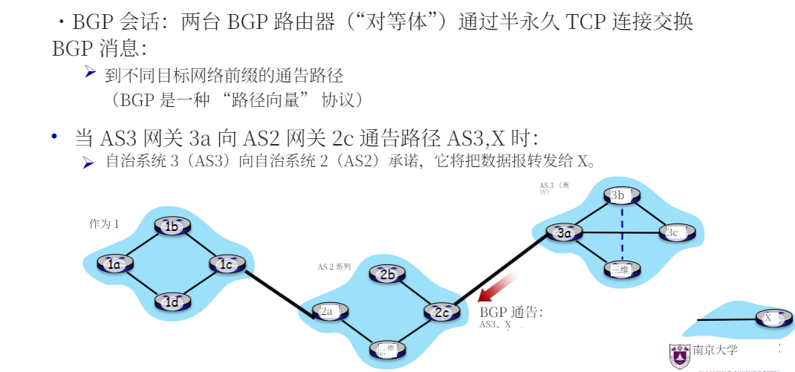

热土豆路由：

广告策略：

### （六）SDN体系结构的4个关键特征？

1. **控制与数据平面分离**：控制器集中管理路由逻辑，数据平面交换机仅负责转发。
2. **集中式控制**：控制器通过全局视图优化网络流量（如负载均衡、流量工程）。
3. **可编程转发**：基于流表（Flow Table）的灵活转发规则，支持自定义匹配字段和动作（如 OpenFlow）。
4. **开放接口**：北向接口（Northbound API）支持应用层程序与控制器交互，南向接口（Southbound API）连接控制器与交换机。

### （七）什么是ICMP？

- **网际控制消息协议（ICMP）** 是网络层协议，用于主机与路由器间传递控制消息。
- 主要功能：
  - **错误报告**：如 “目标不可达”（类型 3）、“TTL 过期”（类型 11）。
  - **诊断工具**：echo 请求 / 应答（ping，类型 8/0）、Traceroute 通过 TTL 递减和 ICMP 超时消息追踪路径。
- **消息格式**：封装在 IP 数据报中，包含类型、代码和触发消息的 IP 头片段。

### （八）网络管理的关键组件？

1. **管理服务器（Manager）**：运行网络管理应用，发送查询 / 配置指令（如 SNMP 管理器）。
2. **被管理设备（Managed Device）**：如路由器、交换机，通过代理（Agent）提供状态数据。
3. **管理信息库（MIB）**：存储设备的配置和状态数据（如接口流量、路由表）。
4. **管理协议**：如 SNMP（简单网络管理协议）、NETCONF（网络配置协议），用于传输管理消息。

### （九）什么是SNMP？

- **简单网络管理协议（SNMP）** 是一种应用层协议，用于网络设备的监控和管理。
- 工作模式：
  - **请求 / 响应模式**：管理器向代理发送 Get/Set 请求，获取或修改 MIB 数据（如接口状态）。
  - **陷阱模式（Trap）**：代理主动向管理器报告异常事件（如链路故障）。
- **版本**：SNMPv1/v2c 基于社区字符串认证，SNMPv3 支持加密和身份验证。

### 课后习题：

## 六、链路层和局域网

奇偶检验：

因特网校验和（拆分16位）：

**循环冗余校验：**

访问协议：

时隙ALOHA：

CSMA（载波监听多路访问）

检测空闲才传输

但是 两个节点具有传播时延，二者开始传播时不能立即知道绝对空闲 还是会有collisions 所以引入CSMA/CD，检测到碰撞时终止

CSMA/CD：

轮流：

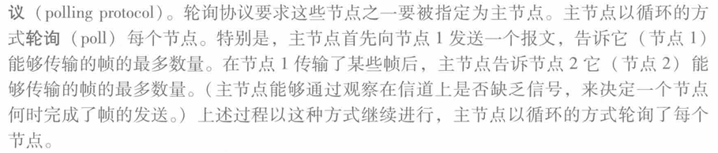

链路层通信：

ARP：

同一局域网：广播

不同局域网：到网关转发，然后广播

目的：得到MAC

之后 通过交换机 mac 接口 表可以找到设备

[局域网、子网、私网、公网、AS 自治系统的概念理解-CSDN博客](https://blog.csdn.net/zhangguoliang_/article/details/148566974?spm=1001.2014.3001.5502)

局域网：

以太网：“主流” 有线局域网技术

总线方式到交换机

不可靠无连接

**全双工**

交换机自学习算法：

VLAN：

MPLS：

数据中心：

### （一）什么是节点、链路？

- **节点**：指网络中的主机（hosts）和路由器（routers）等设备，是通信路径上的相邻连接点。
- **链路**：指连接相邻节点的通信通道，分为有线和无线类型，例如局域网（LANs）中的连接。

### （二）链路层提供的可能服务包括？链路层在何处实现？

**服务包括**：

- **成帧（Framing）**：封装网络层数据报为帧。
- **链路接入控制**：共享信道时决定发送时机（MAC地址在帧头中用于识别）。
- **可靠传输（少用）**：对无线等高误码链路有用。
- **流量控制**：防止发送方压垮接收方。
- **差错检测与纠正**：识别或纠正传输中产生的比特错误。
- **半双工与全双工支持**

**实现位置**：在主机或路由器的网卡（NIC）中，通常由硬件、软件与固件共同实现

### （三）奇偶校验、检验和、循环冗余检测的基本原理？

- 奇偶校验：
  - **单比特奇偶校验**：通过设置奇偶位使数据中 1 的个数为偶数或奇数，用于检测单比特错误。
  - **二维奇偶校验**：将数据排列成矩阵，计算行和列的奇偶位，可检测并纠正单比特错误。
- **检验和（Internet Checksum）**：将数据视为 16 位整数序列，计算其补码和，用于检测传输段中的比特翻转错误。
- **循环冗余检测（CRC）**：通过生成多项式 G 对数据 D 进行模 2 除法，得到余数 R 作为校验码，接收方用 G 验证 D 和 R 的组合是否可整除，可检测小于 r+1 位的突发错误，广泛用于以太网和WiFi中。

### （四）多路访问协议分为哪三种类型？每种类型的工作原理？

- 信道划分协议：
  - **原理**：将信道划分为时间槽、频率段或码片，分配给节点独占使用。
  - **示例**：TDMA（时分多路访问）将时间划分为固定长度槽，节点轮流传输；FDMA（频分多路访问）将频谱划分为频段，节点占用特定频段。
- 随机访问协议：
  - **原理**：节点可随时传输，允许碰撞，通过碰撞检测和退避机制恢复。
  - **示例**：ALOHA、CSMA/CD，节点发送前监听信道，碰撞后随机延迟重传。
- 轮流协议：
  - **原理**：节点按顺序轮流使用信道，允许传输时间较长的节点占用更多资源。
  - **示例**：轮询（中央控制器邀请节点传输）、令牌传递（节点通过令牌获取传输权）。

### （五）什么是CSMA？什么是CSMA/CD？它们的工作原理和区别是什么？

**CSMA（载波监听多路访问）**：

- 听信道空闲则发送，忙则等待，防止冲突。
- 类似 “不打断他人对话”，但可能因传播延迟导致碰撞

**CSMA/CD（带冲突检测的CSMA）**：

- 发送时同时监听信道，若检测到冲突，立即停止发送并发送干扰信号（jam signal），然后退避随机时间重试。

**区别**：

- CSMA避免冲突，**CSMA/CD**检测冲突并快速中止传输。
- CSMA/CD适用于**有线以太网**，不适用于无线（无法检测）

### （六）MAC地址的表示方式？

- 48位（6字节）二进制地址，常以16进制表示，如 `1A-2F-BB-76-09-AD`。

- 每个网卡唯一，通常烧录在ROM中，由IEEE统一分配。

- 与IP地址不同，**MAC地址是扁平结构，可跨网络使用**

### （七）地址解析协议的工作原理？

- ARP（Address Resolution Protocol）：
  - **目的**：通过 IP 地址获取对应的 MAC 地址。
  - 过程：
    1. 发送方广播 ARP 查询包，包含目标 IP 地址，目标 MAC 地址为全 F（FF-FF-FF-FF-FF-FF）。
    2. 所有节点接收查询，目标 IP 匹配的节点回复单播 ARP 响应，包含自身 MAC 地址。
    3. 发送方更新 ARP 表，缓存 IP-MAC 映射关系（通常带 TTL 过期机制）。

### （八）交换机和路由器的区别？

- 交换机：
  - **层次**：链路层设备，处理帧头中的 MAC 地址。
  - **转发方式**：自学习机制，通过记录帧的源 MAC 地址和接口构建转发表，支持广播、多播和单播转发。
  - **特点**：透明工作，即插即用，每个接口为独立碰撞域。
- 路由器：
  - **层次**：网络层设备，处理 IP 报头中的 IP 地址。
  - **转发方式**：通过路由算法（如 RIP、OSPF）构建路由表，基于最长前缀匹配转发数据包。
  - **特点**：连接不同网络，隔离广播域。

### （九）多协议标签交换技术？

**MPLS（Multiprotocol Label Switching）**：通过在IP包前加标签（label）来转发。

- **优势**：基于固定长度标签转发，查表速度快。
- 可按源地址、应用类型实现**流量工程与快速重路由**。
- **MPLS路由器**根据标签查表转发，不检查IP地址。
- 被视为**虚电路交换与IP包交换的结合**

### （十）数据中心网络的等级拓扑？

常见结构为**分层拓扑**，包括：

1. **TOR（Top-of-Rack）交换机**：每个机架一个，连接多个服务器。
2. **第二层（Tier-2）交换机**：连接多个TOR。
3. **第一层（Tier-1）交换机或核心层**：连接多个Tier-2。
4. **边界路由器（Border Routers）**：连接数据中心与外部网络。

**特性**：

- 支持多路径路由（提高吞吐与容错）。
- 应用层负载均衡器控制访问。
- 使用ECN、SDN、RoCE等新技术优化性能

### 课后习题：

## 七、无线网络和移动网络

无线链路特性：

- 衰落
- 多路径（反射）

- 噪声

- 隐藏终端

CDMA：

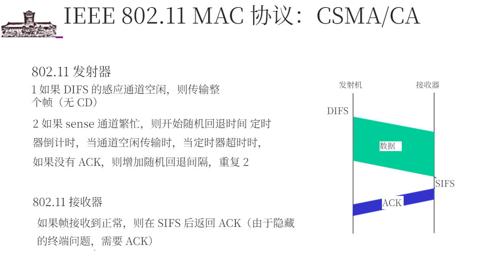

### （一）什么是无线主机、无线链路、基站？什么是基础设施模式、自组织网络？

1. **无线主机**：支持无线通信的终端设备（如手机、笔记本、IoT 设备），可静止或移动，通过无线链路接入网络。
2. **无线链路**：连接无线主机与基站的物理层通道，支持多址协议（如 CSMA/CA），具有动态速率和衰减特性。
3. **基站**：无线与有线网络的中继节点（如 WiFi 的 AP、4G 的 eNode-B），负责覆盖区域内的信号转发和资源管理。
4. **基础设施模式**：通过基站连接无线主机与有线网络（如 WiFi、蜂窝网络），支持漫游切换。
5. **自组织网络（Ad Hoc）**：无基站，节点自组多跳网络（如蓝牙、MANET），依赖分布式路由。

### （二）什么是多径传播、信噪比？隐藏终端问题？

1. **多径传播**：信号经反射 / 散射后不同路径到达，导致时延扩展，影响传输速率（如 WiFi 的符号间干扰）。
2. **信噪比（SNR）**：信号功率与噪声功率比，决定误码率（BER），动态调整调制方式（如 802.11 根据 SNR 切换 QAM/BPSK）。
3. **隐藏终端问题**：节点 A 和 C 无法感知对方，同时向 B 发送导致冲突（如 A→B 传输时，C 因信号衰减未检测到 A，仍发送至 B）。

### （三）CDMA的基本工作原理？

- **正交码分复用**：每个用户分配唯一正交码（如 Walsh 码），通过内积运算编码 / 解码，允许同频同时传输。
- **抗干扰性**：多用户信号叠加后，接收机通过匹配自身码提取数据，非正交码干扰被抑制（如 Sender1 和 Sender2 的正交码互不干扰）。

### （四）被动扫描、主动扫描？

1. **被动扫描**：主机监听 AP 周期性广播的信标帧（含 SSID、MAC），选择信号最强的 AP 关联（步骤：信标→关联请求→响应）。
2. **主动扫描**：主机广播探测请求（Probe Request），AP 回复探测响应（Probe Response），耗时更长但可发现非信标 AP（步骤：探测→响应→关联）。

### （五）CSMA/CA的工作原理？

1. **监听信道**：发送前检测空闲（DIFS 时长），否则启动随机退避。
2. **退避机制**：信道忙时倒计时，空闲则发送；冲突后指数退避（避免连续碰撞）。
3. **ACK 确认**：接收方短间隔（SIFS）回复 ACK，解决隐藏终端导致的无碰撞检测问题。
4. **RTS/CTS 握手**：发送长数据前用短帧预约信道，覆盖隐藏终端（RTS→CTS→数据→ACK）。

### （六）4G LTE架构的部件？

1. **UE（用户设备）**：含 SIM 卡（IMSI 标识），支持无线接入。
2. **eNode-B（基站）**：管理无线资源，协调切换（类似 WiFi 的 AP，但支持移动性）。
3. **MME（移动管理实体）**：负责认证、会话管理、切换控制。
4. **HSS（归属用户服务器）**：存储用户签约信息（如归属网络、权限）。
5. **S-GW/P-GW（服务网关 / 分组网关）**：数据转发（S-GW 锚定用户移动，P-GW 连接互联网）。

### （七）到移动设备的间接路由？到移动设备的直接路由？

1. **间接路由（三角路由）**：通信先至归属网络（P-GW），再通过隧道转发至当前接入点（S-GW），对通信方透明（如 4G 的 GTP 隧道）。

2. **直接路由**：通信方从归属网络获取移动设备的外地地址（Care-of Address），直接发送（需更新地址，存在三角路由优化）。

3. 一、**间接路由（Indirect Routing）：归属网络中转的 “三角路径”**

   1. **核心原理**

      - **归属网络锚定**：所有发往移动设备的数据先到达其 “归属网络”（如 4G 中的 P-GW），再通过隧道转发至当前接入点（如 S-GW）。
      - **隧道技术**：通过 GTP（GPRS Tunneling Protocol）等协议封装数据，隐藏移动设备的实时位置。例如：
        ▶ 通信方发送数据到移动设备的归属 IP（类似家庭地址）；
        ▶ 归属网络（P-GW）通过 GTP 隧道将数据转发至移动设备当前连接的 S-GW（类似家人转寄邮件）。

   2. **典型场景：4G 网络中的三角路由**

      - 流程示例

        ：

        1. 手机 A（归属网络为中国移动）连接到上海的基站 eNodeB1，S-GW1 为其服务；
        2. 电脑 B 向手机 A 发送数据，先到中国移动的 P-GW（归属锚点）；
        3. P-GW 通过 GTP 隧道将数据转发至 S-GW1，再由 eNodeB1 传给手机 A；
        4. 若手机 A 移动到北京，切换至 eNodeB2 和 S-GW2，P-GW 仅需更新隧道端点，电脑 B 无需感知变化（文档 2-353、2-357）。

   3. **优缺点**

      - **优点**：对通信方透明，移动设备切换网络时无需修改上层协议（如 TCP 连接不中断）。
      - **缺点**：数据需绕行归属网络，形成 “三角路由”（如上海→北京→上海），增加延迟和带宽消耗。

   二、**直接路由（Direct Routing）：获取实时地址的 “直达路径”**

   1. **核心原理**

      - **外地地址（Care-of Address）**：移动设备在访问网络时获取临时地址（如 4G 中的 S-GW 分配的 IP），通信方直接向该地址发送数据。
      - **地址注册机制**：移动设备通过归属网络（如 HSS）注册当前地址，通信方需主动查询该地址（类似朋友直接问你当前住址）。

   2. **典型场景：移动 IP（Mobile IP）的优化路径**

      - 流程示例

        ：

        1. 手机 A 从归属网络获取永久 IP（如 10.0.0.1），漫游到外地网络时获取 Care-of Address（如 20.0.0.1）；
        2. 手机 A 向归属网络的 HSS 注册 20.0.0.1；
        3. 电脑 B 访问手机 A 时，先查询 HSS 获取其当前 Care-of Address，直接发送数据到 20.0.0.1；
        4. 若手机 A 切换至新网络，需重新注册地址，电脑 B 需更新路由（文档 2-316、2-318）。

   3. **优缺点**

      - **优点**：避免三角路由，数据直达目标，提升传输效率。
      - **缺点**：
        ▶ 通信方需支持地址查询协议（如 Mobile IP 的代理发现）；
        ▶ 移动设备切换网络时需实时更新地址，可能导致短时中断（如 TCP 重传）。

      - **间接路由**：朋友始终将邮件寄到你老家地址，老家父母再转寄到你当前住址（归属网络中转）。
      - **直接路由**：朋友每次联系你时，先问你当前住址，再直接寄信（获取 Care-of Address 直达）。

### （八）移动设备从源基站切换到目标基站的步骤？

1. **测量与决策**：源 eNode-B 监测信号质量，选择目标 eNode-B（基于 RSSI、负载）
2. **资源预留**：目标 eNode-B 预分配无线资源，回复切换请求确认（含临时 ID、安全参数）
3. **数据转发**：源 eNode-B 将缓存数据通过隧道转发至目标 eNode-B，避免丢包
4. **路径更新**：MME 通知 S-GW 更新隧道端点，数据直接经目标 eNode-B 传输（切换完成时间 < 100ms）

### 课后习题：

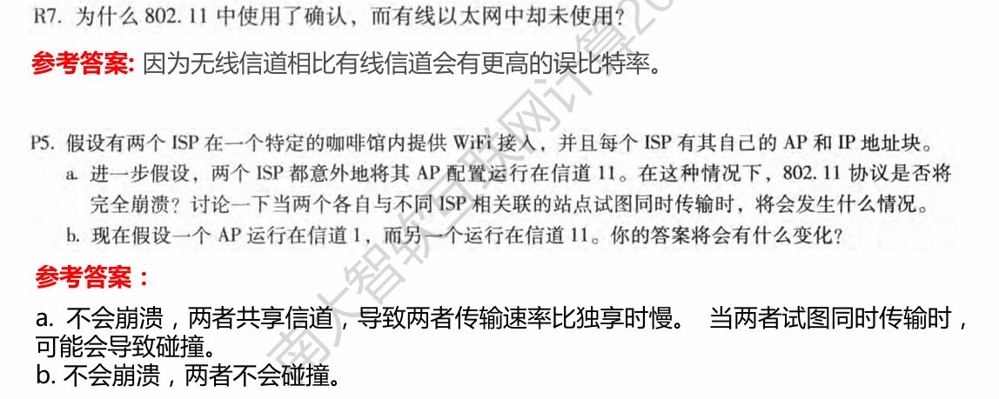

## 八、计算机网络中的安全

### （一）安全通信包括哪四个方面的性质？

1. **保密性（Confidentiality）**：仅发送方和预期接收方能够理解消息内容，通过发送方加密、接收方解密实现。
2. **认证（Authentication）**：通信双方确认彼此身份，确保对方为合法参与者。
3. **消息完整性（Message Integrity）**：确保消息在传输过程中未被篡改，任何修改都能被检测到。
4. **访问与可用性（Access and Availability）**：保证服务对用户可访问且可用。

### （二）对称密钥系统与公开密钥系统的区别？

| **对比项**      | **对称密钥系统**                         | **公开密钥系统**                                        |
| --------------- | ---------------------------------------- | ------------------------------------------------------- |
| **密钥数量**    | 通信双方共享同一密钥（如 DES、AES）。    | 每个用户拥有公钥（公开）和私钥（保密）（如 RSA）。      |
| **密钥管理**    | 需安全传输共享密钥，适用于双方已知场景。 | 公钥可公开分发，私钥仅本人持有，解决密钥协商问题。      |
| **加密 / 解密** | 同一密钥用于加密和解密。                 | 公钥加密、私钥解密，或私钥签名、公钥验证。              |
| **计算效率**    | 效率高，适用于大量数据加密。             | 效率低，常与对称密钥结合（如用 RSA 协商对称会话密钥）。 |

### （三）RSA算法的工作原理？

### （四）密码散列函数的性质？

1. **多对一映射**：不同输入可能生成相同输出（碰撞），但应尽量减少碰撞概率。
2. **固定长度输出**：输入任意长度数据，生成固定长度摘要（如 MD5 生成 128 位，SHA-1 生成 160 位）。
3. **单向性**：从摘要反推原始数据在计算上不可行（抗原像攻击）。
4. **抗碰撞性**：难以找到两个不同输入生成相同摘要（抗第二原像攻击）。

### （五）数字签名的基本原理？

### （六）鉴别协议及其安全性？

1. **基础协议演进**：
   - **ap1.0**：直接声明身份（如 “我是 Alice”），易被冒充。
   - **ap2.0**：用 IP 地址认证，但 IP 可伪造（欺骗攻击）。
   - **ap3.0**：发送密码，但密码可被截获或回放。
   - **ap4.0**：引入随机数（nonce），用对称密钥加密回复，防止回放。
   - **ap5.0**：用公钥加密 nonce，但存在中间人攻击（Trudy 伪造证书）。
2. **安全性增强**：通过证书认证机构（CA）绑定公钥与身份，防止中间人攻击。

### （七）IPSec协议族中的两个重要协议？

1. **认证头协议（AH，Authentication Header）**：
   - 提供源认证和数据完整性，但不加密 payload
   - 通过哈希或 MAC 算法验证数据包未被篡改
2. **封装安全载荷协议（ESP，Encapsulation Security Payload）**：
   - 除认证和完整性外，还加密 payload，提供保密性
   - 支持隧道模式（封装整个 IP 包）和传输模式（仅加密上层数据）

### （八）防火墙包括哪三类？这三类的主要区别？入侵检测系统与防火墙的主要区别？

1. **防火墙分类及区别**：
   - **无状态包过滤**：基于 IP、端口、协议等头部信息过滤，不跟踪连接状态，规则简单但易漏过非法包。
   - **有状态包过滤**：跟踪 TCP 连接状态（如 SYN、ACK），仅允许合法连接的数据包通过，减少误判。
   - **应用网关**：在应用层过滤，分析数据包内容（如 HTTP、FTP），需为特定应用定制，安全性高但效率低。
2. **IDS 与防火墙的区别**：
   - **防火墙**：位于网络边界，实时过滤进出流量，阻止已知威胁；
   - **入侵检测系统（IDS）**：被动监控流量，深度分析数据包内容和行为模式（如病毒特征、异常流量），发现攻击后报警，但不直接阻止。

### 课后习题：

